# InChI Technical Manual

**IUPAC International Chemical Identifier (InChI)**
**InChI version 1, Software version 1.07-beta3**
**Technical Manual**
**Stephen E. Stein, Stephen R. Heller, Dmitrii V. Tchekhovskoi**
Biomolecular Measurement Division
National Institute of Standards and Technology
Gaithersburg, Maryland, U.S., 20899-8320

**Igor V. Pletnev**
Department of Chemistry
Lomonosov Moscow State University
119991 Moscow, Russia

Last revision date: January 19, 2024

## CONTENTS

[//]: <> (TODO: Table of content)

## ABSTRACT

This document presents a technical description of the IUPAC
International Chemical Identifier (InChI) and its hashed representation
(InChIKey). It explains the methods used for the creation of the various
output ‘layers’ of the InChI and describes the scope of its application.
Rules used to resolve ambiguities in input information are also
described.

Appendices list valences and abbreviations, discuss the processing of
the Identifier and describe some relevant general problems in the
representation of chemical identity.

## INTRODUCTION

### The IUPAC International Chemical Identifier (InChI)

The objective of the Identifier is to provide a string of characters
capable of uniquely representing a chemical compound. This involves
finding and implementing a set of rules that transform an input
‘connection table’ into an output sequence of characters. Since InChI is
intended to serve as a precise digital signature of a compound, it must
have two properties: 1. different compounds (as defined by their
‘connection tables’) must have different identifiers and 2. a single
compound must have a single identifier, regardless how its structure is
drawn. The first requires the inclusion of all of the chemical features
that distinguish one compound from another. The second requires the
elimination of input information that reflects only the conventions used
for drawing the compound.

Since a given compound may be represented at different levels of detail,
in order to create a robust expression of chemical identity it was
decided to create a hierarchical ‘layered’ form of the Identifier, where
each layer holds a distinct and separable class of structural
information, with the layers ordered to provide successive structural
refinement. In addition to basic ‘connectivity’ and overall charge, the
principal varieties of layers are mobile/fixed H-atoms (expresses
tautomerism), isotopic composition and stereochemistry.

The Identifier is created from the input structure in three steps:

1. normalization (removing information not needed for layer
    construction and separating information into layers);

2. canonicalization (generating a set of atom labels that do not depend
    on how the structure was initially drawn);

3. serialization (converting the set of labels derived from
    canonicalization into a string of characters, the InChI).

The chemical ideas employed for creating the InChI appear in the
normalization step, where conventions are removed while maintaining a
complete description of the compound.

This ‘layered’ model allows chemists to represent chemical substances at
a level of detail of their choosing. Except for the main layer (atoms
and their bonds), the presence of a layer is not required and appears
only when corresponding input information has been provided. Moreover,
because of inherent difficulties in fully describing certain structural
details of some chemical substances, the main layer of the InChI is
expected to provide a stable and reliable means for identifying complex
chemical substances. Adequate perception of mobile H-atoms required
rather complex rules. They were needed to deal with combined effects of
the different conventions employed for drawing chemical structures and
the fact that the details of the isomerizations caused by migration of
these H-atoms can depend on structural details and chemical environment.
Rules were based on earlier published work with extensions based on
experience with test sets, also using input from interested parties.
Other rules were developed largely to perceive and, when possible
correct inadequacies in input stereochemical information.

Since 2007 (software release v. 1.02-beta), InChI is complemented by its
counterpart – a hashed identifier, InChIKey. This character signature
should be helpful in search applications, including Web searching and
chemical structure database indexing; also, this hash may serve as a
checksum for verifying InChI, for example, after transmission over a
network.

The Identifier’s layered structure, allows the InChI Software to
generate different InChI strings for the same molecule, depending on the
choice of a multitude of options (e.g., distinguishing or not
distinguishing tautomers). This flexibility, however, may be considered
a drawback with respect to standardization/interoperability. To overcome
it, since 2009 (software release v. 1.02-standard), the ‘standard’ InChI
(and the standard InChIKey) which is always produced with fixed options,
has been made available

The current version of InChI Identifier is 1; the current stable version
of the InChI software is 1.06. Version 1.07-beta3 is currently tested.
Previously released versions 1.01 (2006), 1.02-beta (2007),
1.02-standard (2009), 1.03 (June 2010), 1.04 (September 2011), and 1.05
(January 2017) as well as all earlier versions, are now considered
obsolete.

### Objective of this Document

The principal objective of this document is to describe the technical
issues (especially those involved in structure ‘normalization’ steps) in
the current version of the InChI. This includes both the scope of
chemical substances covered by the InChI as well as the means of dealing
with a variety of common problems involved in the representation of
chemical compounds. Mathematical details of the algorithms used will not
be presented. They have been derived from methods reported in the
literature (listed in the Bibliography section at the end of this
document). They will be made available in the form of tested and
documented source code along with the final version of the InChI.

### Other Reading

For a briefer and less technical description, look at: *Heller, S.,
McNaught, A., Pletnev, I., Stein, S., and Tchekhovskoi, D. InChI, the
IUPAC international chemical identifier. Journal of Cheminformatics 7
(2015), 23–23*. DOI:
[10.1186/s13321-015-0068-4](http://dx.doi.org/10.1186/s13321-015-0068-4)

For much more brief description, as well as background and history, look
at*: Heller, S., McNaught, A., Stein, S., Tchekhovskoi, D., and Pletnev,
I. InChI - the worldwide chemical structure identifier standard. Journal
of Cheminformatics 5 (2013), 7–7*. DOI:
[10.1186/1758-2946-5-7](http://dx.doi.org/10.1186/1758-2946-5-7)

For InChI FAQ, see:

<http://www.inchi-trust.org/technical-faq/>

## DISCUSSION

### The Scope of the InChI

It was agreed at IUPAC meetings prior to the start of this project that
the first version of the InChI should cover well-defined,
covalently-bonded organic molecules. It was also agreed to include
substances with mobile hydrogen atoms (tautomers, for instance). In the
course of this project, it was found that with a straightforward
extension organometallic compounds could be represented. Methods were
found to also include variable protonation. Not included are molecular
class representations (Markush structures), electronic states and
conformations. Also, the present version only considers traditional
organic stereochemistry (double bond - sp&#178; and tetrahedral -
sp&#179;) and the most common forms of H-migration (tautomerism).
However, the layered structure of the InChI allows future refinements
with little or no change to the layers described here.

By design, the InChI represents only a single type of connectivity (it
ignores bond orders except for analyzing stereochemistry and
H-migration) and does not explicitly represent positions of electrons.
While this is not the conventional method for representing compounds, it
provides an effective means of representing their identity.

In summary, the InChI is a series of characters derived by applying a
set of rules to a chemical structure to provide a unique digital
‘signature’ for a compound. It has been developed under IUPAC auspices
to serve as a uniform, openly available digital ‘name’ for a compound.
It is expected that its principal use will be as a ‘plug-in’ for other
chemical structure-based software systems.

### Construction of the InChI

The InChI string is composed of one or more ‘layers’ that are
successively built from information extracted from an input ‘connection
table’. Each layer is expressed as a string of characters. Layers are
appended to one another in a strictly defined order: each layer except
for the first layer has one and only one preceding (parent) layer. If
the data necessary to create a layer is not available, that layer is
omitted from the InChI representation unless it is a “repeating” layer
and its preceding layer is not empty. In this case the empty layer is
output. If a “repeating” layer is identical to its preceding layer, the
layer is omitted. These two “repeating layer” rules in many cases allow
one to output the stereochemical or the isotopic layer only once. Values
computed for each layer depend on prior layers. As a consequence, for
example, two stereochemical layers for different compounds cannot be
directly compared – comparisons must involve the complete set of
preceding layers. On the other hand, layers do not depend on successive
layers. Therefore, if two InChI strings are identical up to a layer,
then the structural characteristics of the two represented structures
are also identical up to that point. For brevity, if a requisite layer
is identical to an earlier one in the same Identifier, abbreviations are
used. For example, isotopic sublayers that are exactly equal to their
non-isotopic preceding counterparts are omitted when no ambiguity is
created. Abbreviations and layer precedence are given in Appendix 2.

### InChI Components

For structures that are composed of multiple interconnected (covalently
bonded) components, a single InChI is generated, but each of the
components retains its identity. Each layer contains information
pertinent to all of the components (these are represented as
conventional ‘dot-disconnected’ units in the formula layer, or with
semicolons in other layers). In general, a valid InChI of an individual
component of a more complex compound may be obtained by simply excising
it from the InChI string. Details are given in Appendix 3.

### The Main InChI ‘Layer’ Types

Depending on the information contained in the input structure, the InChI
may be composed of up to five distinct varieties of ‘layers’, each
representing a different class of structural information. These layers
are discussed below and illustrated in Figure 1. Specific examples and
more details are presented later.

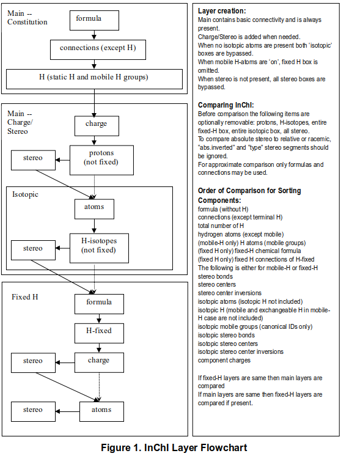

The first two layers (chemical formula and connections) are derived
solely from the simple connectivity information in the input structure.
They entirely ignore pi-electrons and charge as well as stereochemical,
tautomeric and isotopic information.

#### 1. Main Layer

##### 1.1 Chemical Forumal

For a compounds composed of a single component, this is the conventional Hill-sorted elemental formula. For compounds containing multiple components, the Hill-sorted formulas of the individual components are sorted according to the guidelines in Figure 1 and separated by dots.

##### 1.2 Connections

This lists the bonds between the atoms in the structure, partitioned into as many as three sublayers. The first represents all bonds other than those to non-bridging H-atoms, the second represents bonds of all immobile H-atoms, and the third provides locations of any mobile H-atoms. The last sublayer represents H-atoms that can be found at more than one location in a compound due to well-known varieties of isomerization. It identifies the groups of atoms that share one or more mobile hydrogen atoms In addition to hydrogen atoms, mobile H groups may contain mobile negative charges.  These charges are included in the charge layer.

#### 2. Charge Layer

This represents net charge (surplus of protons over electrons) and does not depend on the contents of other layers. It may appear in as many as two sublayers:

##### 2.1 Component Charge

The net charges of the components are represented in this layer as independent tags. By design, the InChI does not distinguish between structures that differ only in the formal positions of their electrons.

##### 2.2 Protons

The number of protons removed from or added to the substance so that a given component may be represented without regard to its degree of protonation.

#### 3. Stereochemical Layer

This is composed of two sublayers: the first accounts for double bond, sp² stereochemistry and the second for tetrahedral stereochemistry and allenes. Note that the first sublayer is independent of the second, but not vice-versa.

##### 3.1 Double Bond sp&#178; (*Z*/*E*) Stereo

Expression of this stereo configuration is easily done in 2-dimensional drawings. When double bonds are rigid, stereoisomerism is readily represented without ambiguity. However, in alternating bond systems, some non-rigid bonds may be formally drawn as double. Bonds in these systems, when discovered by InChI algorithms, are not assigned stereo labels. Also, to avoid needless stereodescriptors in aromatic and other small rings, no sp² stereoisomerism information is generated in rings containing 7 or fewer members.

##### 3.2 Tetrahedral Stereo

Tetrahedral (typically, sp³) stereochemistry is readily represented using conventional wedge/hatch (out/in) bonds commonly employed in 2D drawings. Relative tetrahedral stereochemistry is represented first, optionally followed by a tag to indicate absolute stereochemistry. When a stereocenter configuration is not known to the structure author, an ‘unknown’ descriptor may be specified, which will then appear in the stereo layer. If a possible stereocenter is found, but no stereo information is provided, it will be represented in a stereolayer by a not-given (‘undefined’) flag.
In InChI Software since v. 1.04 (2011) a question mark (‘?’) is used, by default, for both ‘undefined’ and ‘unknown’ flags. However, in a non-standard InChI generated with option ‘SLUUD’ turned On,  the symbol ‘u’ is used to indicate explicitly entered ‘unknown’ stereo (while ‘?’ is retained for ‘undefined’).

#### 4. Isotopic Layer

This is a layer in which different isotopically labeled atoms are identified. Exchangeable isotopic hydrogen atoms (deuterium and tritium) are listed separately. The layer also holds any changes in stereochemistry caused by the presence of isotopes.

#### 5. Fixed H-Layer

When potentially mobile H atoms are detected and the user specifies that they should be immobile (tautomerism not allowed), this layer binds these H atoms to the atoms specified in the input structure. When this, in effect, causes a change in earlier layers, appropriate changes are added to this layer (earlier layers 1-4 are not affected).

#### 6. Polymer Layer

InChI Software v. 1.05 added a new experimental  polymer ('/z') layer. This is modification layer which is optionally built "above" the other layers and does not affect their content. For more details, see Section IV.f below.

### InChI Structure

Figure 2 below describes the ordering of all possible layers in an
Identifier (experimental polymer layer is not shown; see Section IV.f).
Individual layers are preceded by /? where ? is a lowercase letter that
distinguishes that layer. In the Identifier itself, actual layer
contents replace the annotations shown below in curly braces. Titles in
Italics are shown only for clarity.

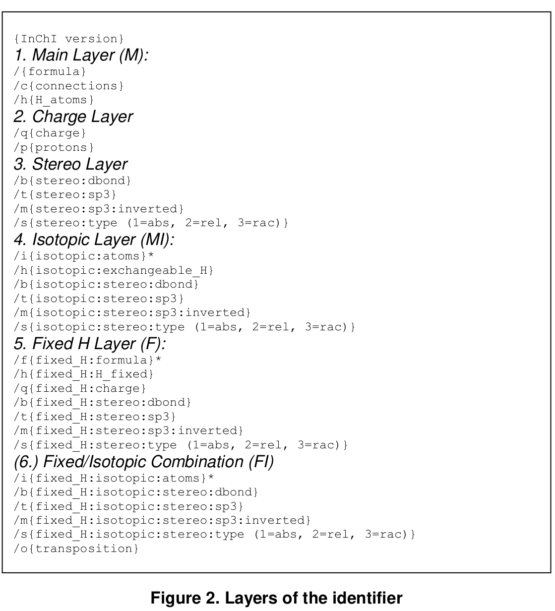

Construction of the Identifier involves, in effect, the in-memory
labeling of the atoms in the input connection table, with equivalent
atoms assigned identical labels by the canonicalization procedure, along
with rules for outputting (serializing) that information. The isotopic
layers (one derived from the main layer and a second derived, when
needed, from the fixed H layer) simply provide the labels of the
isotopic atoms. Stereo layers contain the parity assignments for
specific atoms and bonds, and are separately derived as required for up
to four layer sequences, M, MI, F, FI . A ‘serialization’ routine
produces output character strings for each of the layers. Note that if
no information is available for a layer, that layer is omitted. For
example, when there is no isotopic labeling, the layer MI and FI part of
Fixed H layer are not present.

The Identifier may be accompanied by an Auxiliary Information line that
has the following structure (experimental polymer related data are not
shown):

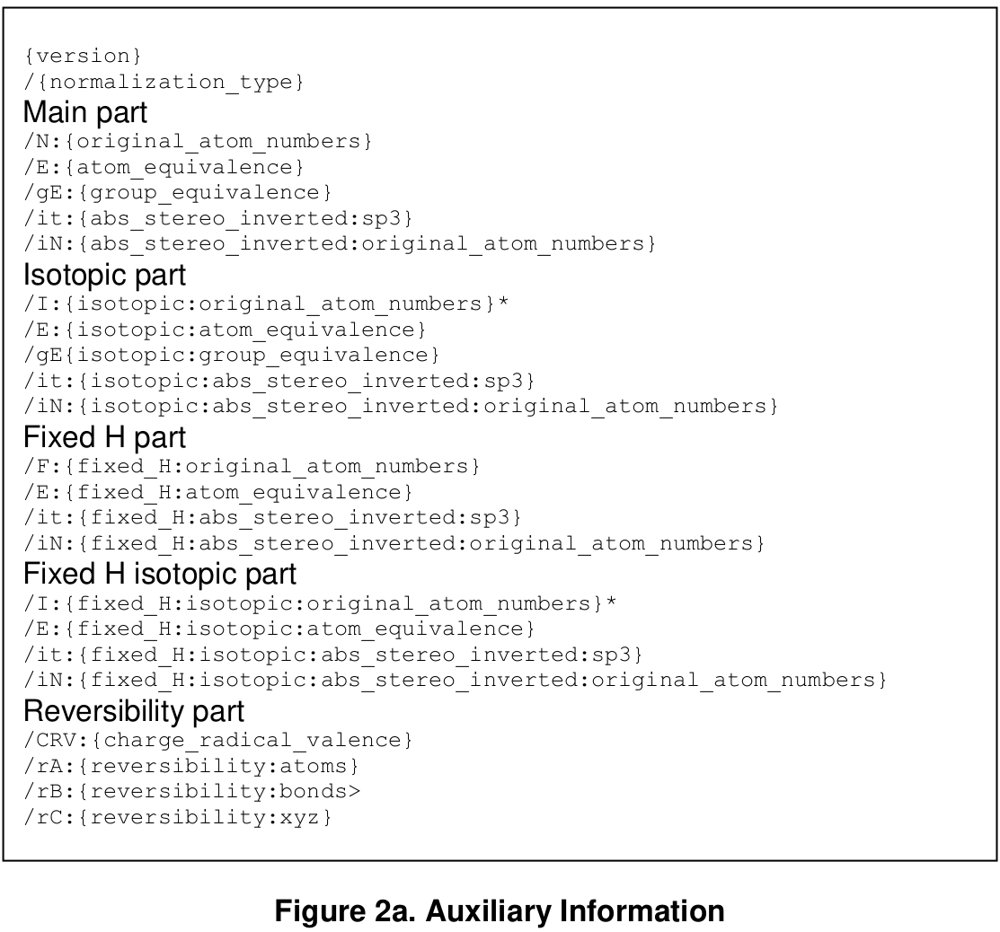

It contains mapping of canonical numbers on original atom numbers,
information on detected constitutional equivalence of atoms and mobile H
groups, stereo of the inverted structure, and reversibility information
that is sufficient to recalculate the Identifier and, in case of input
from a Molfile, reconstruct the Molfile (except the order of the bonds).

### Standard and Non-standard Identifiers

The layered structure of InChI allows one to represent molecular
structure with a desired level of detail. Accordingly, InChI Software
may generate different InChI strings for the same molecule, depending on
the choice of a multitude of options (e.g., distinguishing or not
distinguishing tautomers). This flexibility, however, may be considered
a drawback with respect to standardization/interoperability. In 2009,
the ‘standard’ InChI which is always produced with fixed options was
introduced by IUPAC in response to these concerns.

The standard InChI was defined to ensure interoperability/compatibility
between large databases/web searching and information exchange. As
related to its internal layered structure, standard InChI is a subset of
IUPAC International Chemical Identifier v.1.

The layered structure of the standard InChI conforms to the following
requirements.

- Standard InChI organometallic representation does not include bonds to metal for the time being (so the ‘/r’ layer may not appear).
- Standard InChI distinguishes between chemical substances at the level of ‘connectivity’, ‘stereochemistry’, and ‘isotopic composition’, where:
  - connectivity means tautomer-invariant valence-bond connectivity;different tautomers have the same connectivity/hydrogen layer (so the ‘/f’ layer may not appear);
  - stereochemistry means configuration of stereogenic atoms and bonds; only absolute stereo or no stereo at all is allowed; unknown stereo designations are treated as undefined;
  - isotopic composition means mass number of isotopic atoms (when specified)

For InChI v. 1, the standard InChI is designated by the prefix:

InChI=1S/………..

(that is, the letter ‘S’ immediately follows the Identifier version
number, ‘1’).

The non-standard InChI is designated by the prefix:

InChI=1/………..

(that is, the letter ‘S’ is omitted).

Standard InChI was introduced in v. 1.02-standard release of InChI
Software in 2009 (this software version was capable of generating only
standard InChIs). InChI Software since v. 1.04 (2011) has merged
functionality. It allows one to produce both standard and non-standard
Identifiers, as well as their hashed representations.

The release of InChI v. 1.05 (Winter 2017) added an experimental support
of large (up to 32767 atoms; previous limit was 1024 atoms) molecules,
as well as polymers. To emphasize the experimental nature of this
features, InChI/InChIKey for involved molecules use the ‘B’ flag
character (for “Beta”), instead of ‘S’ or ‘N’. It is supposed that this
flag will be replaced by common standard/non-standard conventions if and
when experimental InChI enhancements are finally adopted.

The exact sets of InChI Software options which lead to generation of
standard vs. non-standard Identifiers are listed in the User Guide
document which accompanies InChI Software release.

### Implementation

Algorithms described here have been implemented in the programs
described in an accompanying ‘User’s Guide’ (winchi-1 and inchi-1
programs). An API (application program interface) is also provided as
well as full source code (in the ‘C’ programming language), makefiles
and examples. The software, examples and documentation are available for
download from IUPAC site (http:// www.iupac.org/inchi). Structures shown
in this document are provided along with these programs.

## DETAILS AND EXAMPLES

### Main Layer (M)

The identity of each atom and its covalently-bonded partners provide all
of the information necessary to construct this layer. All information
regarding π-bonds, charge, isotopic composition, tautomerism and
stereochemistry is ignored. This ‘normalization’ process avoids many of
the complexities commonly encountered in structure representation. For
example, nitro groups can be input using any of the common
representations and problems associated with representing zwitterions
and special valences are avoided as are issues concerning alternating
bonds and aromaticity.

This form of representation is unusual for most chemists, since
conventional structure representations generally include bonding details
that are not needed for chemical identification and often omit some or
all hydrogen atoms. In effect, the present representation describes the
single-bond network of a molecule and avoids any description of the
‘positions’ of all pi-bonds bonds and electrons. Any excess or deficit
of electrons (overall charges) is represented in a separate layer.

Figures 3-6 are examples of input structures, their normalized
structures and results of canonicalization for this basic layer. In the
canonical numbering structure, the large numbers designate classes of
equivalent atoms (an ‘in-memory’ representation), small numbers
(canonical identification numbers) are used in the actual InChI
generation process (serialization).

| Input Structure | Normalized Structure | Canonical Numbering |
| -------- | ------- | ------- |
| 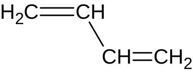 | | |
| or | 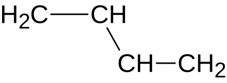 | 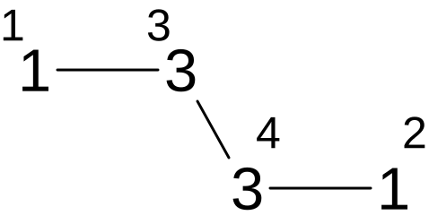 |
| 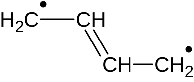 | | |
**Figure 3**

| Input Structure | Normalized Structure | Canonical Numbering |
| -------- | ------- | ------- |
|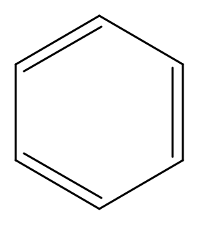|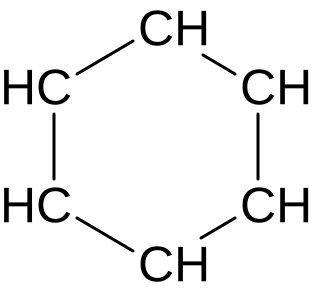|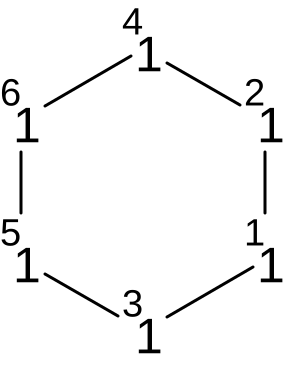|
**Figure 4**

| Input Structure | Normalized Structure | Canonical Numbering |
| -------- | ------- | ------- |
|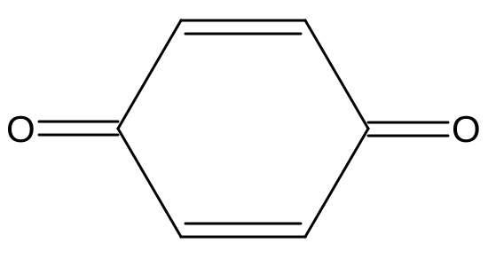|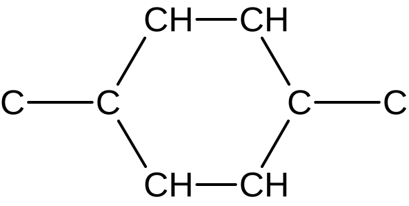|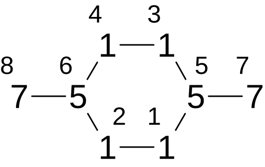|
**Figure 5**

| Input Structures | Normalized Structure | Canonical Numbering |
| -------- | ------- | ------- |
|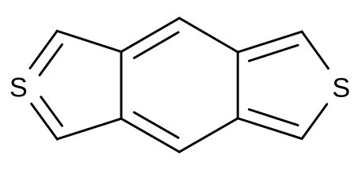| | |
| or |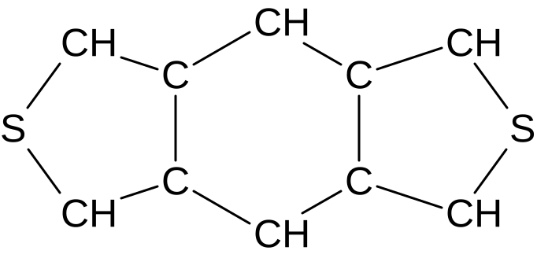|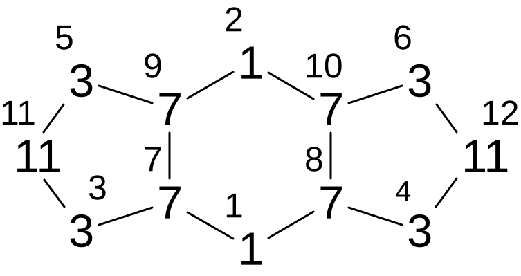| 
|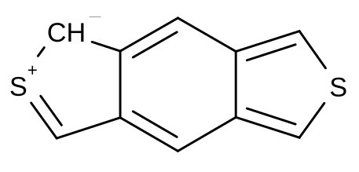| | |
**Figure 6**

‘Munchnones’ serve to illustrate the many different ways that certain
structures may be represented, the last being the normalized form used
for the InChI

| | | | |
| -------- | ------- | ------- | ------- |
|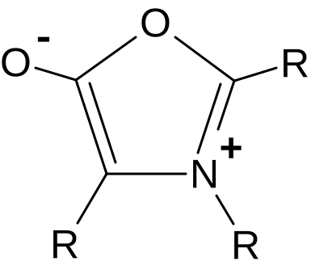| 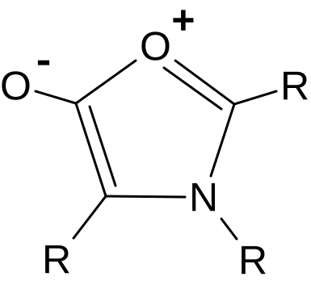 | 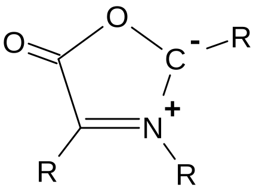 | 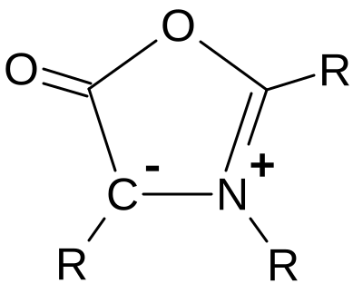 |
|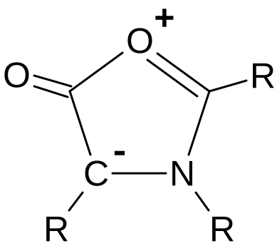| 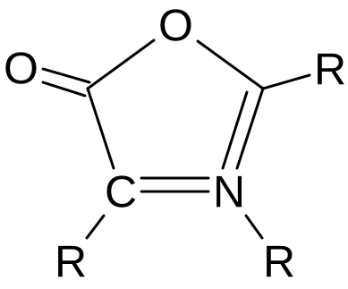 | 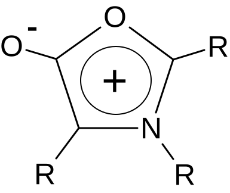 | 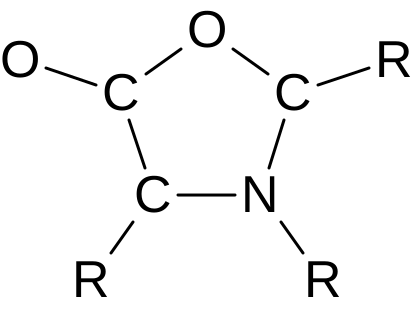 |
**Figure 7**

**While bond orders are not used in the representation, hydrogen atoms
are required. If there is ambiguity concerning the number of H-atoms in
a structure (i.e., its chemical formula is not clear), a reliable InChI
cannot be created. The InChI generator uses accepted valence rules to
detect such ambiguity and issues warnings when detected.**

**b. Normalization**
--------------------

The structures in the above examples did not need normalization steps
except for ignoring bond types and charges. However, the following
additional normalization steps are sometimes needed to, in effect, deal
with ambiguities in structure representation, especially those involving
mobile hydrogen atoms.

InChI applies as many as six varieties of normalization rules to a given
structure. These are described briefly here and in detail later. Steps
1-4 are designed to eliminate a variety of structure drawing conventions
that could interfere with later processing. Step 5 finds protons
necessary to dealing with variable protonation. Step 6, the final
normalization step, includes the discovery of conventional tautomeric
patterns (depicted in Table 6) and ‘resonances’ that may occur due to
bond alternation or positive charge migration along paths of alternating
bonds. When certain negatively charged heteroatoms are present or
additional work is required for complete ‘hard’ proton addition/removal,
step 6 discovers additional patterns of exchanging hydrogen atoms and
charges. In some compounds, resolving these ambiguities results in an
increased ‘mobility’ of H-atoms relative to conventional tautomeric
rules.

The normalization and the stereochemical part heavily rely on testing
whether a bond order can be changed due to the presence of an
alternating bond circuit or the possibility of a hydrogen atom, charge,
or radical center migrating along a path of alternating bonds. This
testing is based on a matching algorithm described in detail in \[4\].

The specific type of normalization performed is provided in the
Auxiliary information section of InChI output. This includes: (1)
conventional tautomerism, (2) additional exchange of H and negative
charges typical for products of heterolytic dissociation, and (3) ‘hard’
removal/addition of protons that is accompanied by a wider exchange of H
and negative charges. When a binary representation of the normalization
type includes the bit corresponding to 2*n* then the type
number (*n*+1) was invoked. For example, normalization type = 6 = 2 + 4
= 23-1 + 22-1 means that (3), ‘hard’ proton
addition/removal, and (2), additional exchange of H and possibly
negative charges, were invoked.

For the fixed H layer, only moving positive charges along paths of
alternating bonds is allowed.

The normalization steps are:

1\. Alter the structure drawing

2\. Disconnect “salts”

3\. Disconnect metals

4\. Eliminate radicals if possible

5\. Process variable protonation

6\. Process charges and mobile H

Note. Many examples of chemical structures below are hypothetical; they
were selected to illustrate the concepts on small structures.

### Step 1. Alter the structure drawing

| **Table 1. Altering the structure drawing** | | | | 
| :--- | :--- | :--- |
| type | Input fragment | | Fixed fragment | note |
| :--- | :--- | :--- | :--- | :--- |
| 1 | 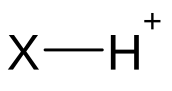 | → | 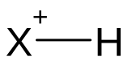 | X is any atom except H |
| 2 | 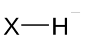 | → | 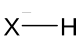 | X is any atom except H |
| 3 | 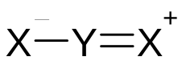 | → | 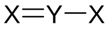 | X=N, P, As, Sb, O, S, Se, Te |
| Example of 3 | 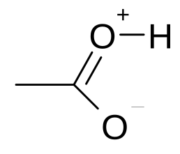 | → | 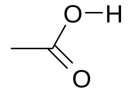 | X = O, Y = C |
| 4 | 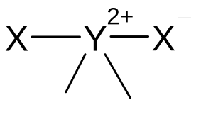 | → | 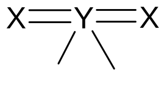 | X=O, S, Se, Te Y=S, Se, Te |
| 5 | 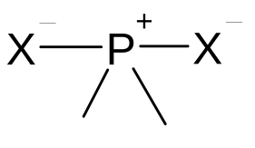 | → | 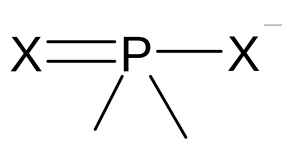 | X=O, S, Se, Te |
| 6 | 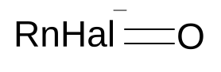 | → | 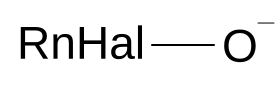. | Hal = F, Cl, Br, I, At |
| Example of 6 | 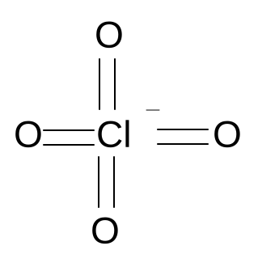 | → | 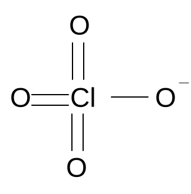 | |
| 7 | 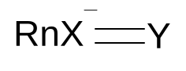 | → | 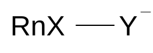 | X = S, Y = O X = Se, Y = S, O X = Te, Y = O, S, Se  (applicable if valence of X exceeds 6, in originally drawn form) |
| Example of 7 | 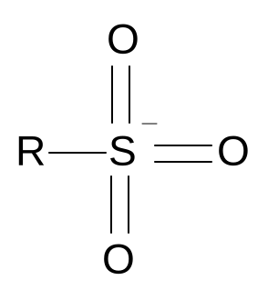 | | 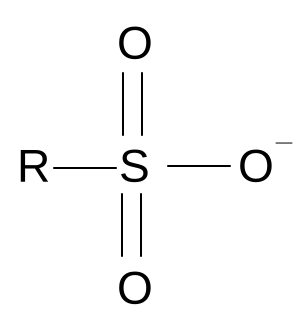 | |
| 8 | 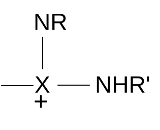 | → | 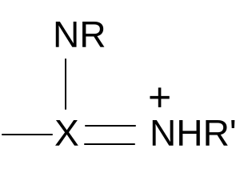 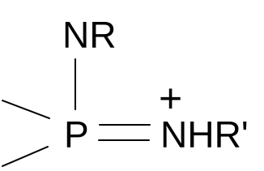 | X = C, S |

| **Table 2. Replacing Ion Pairs with increased order of bonds** | | |
| :--- | :--- | :--- |
| **2-1. Terminal Fragments (Roman numbers in parentheses are formal valences)** | | |
| | **Input and fixed fragments** | **Comments** |
| 1 | | N=N,P,As,Sb; O=O,S,Se,Te |
| 2 | 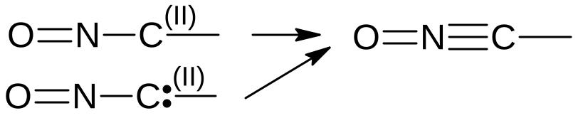 | N=N,P,As; O=O,S,Se,Te |
| 3 | 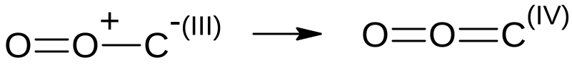 | Same as above |
| 4 |  | Same as above; N+ has not more than 3 bonds |
| 5 |  | Same as above |
| 6 |  | Same as above |
| 7 |  | Same as above; in addition, N**-** may be also Sb**-** |
| 8 |  | N=N,P,As,Sb; O=O,S,Se,Te |
| 9 | | Same as above |
| 10 | | P=P,As,Sb; O=O,S,Se,Te |
| | | |
| **2-2. Non-terminal fragments - 2 atoms** | | |
| | | |
| 1 |  | Same as above |
| 2 |  | Same as above |
| 3 |  | Same as above |
| 4 |  | Same as above |
| 5 |  | Same as above |
| 6 |  | N=N,P,As; O=O,S,Se,Te |
| | | |
| **2-3. Non-terminal fragments - 3 atoms** | | |
| | | |
| 1 |  | Same as above |
| 2 |  | N=N,P,As,Sb; O=O,S,Se,Te |
| 3 |  | Same as above |

### Step 2. Disconnect “salts”

Some salts are commonly represented in either connected or disconnected
forms. The approach used by InChI is to always disconnect salts. The
base definition for recognition of connected salts is:

M-X or Y-M-X

where M is a metal atom and HX, HY are “acids”.

In connected “salts”, metals are connected by single bonds only and do
not have H-atoms connected to them. Metal valences should be the lowest
known to InChI valence or, for some metals, the valence may also be the
2nd lowest valence. Positively charged metals should have the
lowest valence known to InChI (See Appendix 1).

Metals are all elements except these:

| **Table 3. Non-metals** | | | | | |
| :--- | :--- | :--- | :--- | :--- | :--- |
| IIIA | IVA | VA | VIA | VIIA | VIIIA |
| 13 | 14 | 15 | 16 | 17 | 18 |
| | | | | H | He |
| B | C | N | O | F | Ne |
| | Si | P | S | Cl | Ar |
| | Ge | As | Se | Br | Kr |
| | | | Te | I | Xe |
| | | | | At | Rn |

“Acid” is one of the following three:

| HX (X=F, Cl, Br, I) |  |  |
| :--- | :--- | :--- |
| **Figure 8. Acid definition** | | |

Upon disconnection atom X or O of the acid receives a single negative
charge; the charge of the metal is incremented.

Substances drawn as H4N-X are disconnected to NH3
and HX.

Several examples are shown in the Table 4:

| **Table 4. Examples of salt disconnection** | | | | | |
| :--- | :--- | :--- | :--- | :--- | :--- |
| | connected | | disconnected | | |
| 1 | NH4-O-C | → | NH3 | + | HO-C |
| 2 | NH4-X | → | NH3 | + | HX (X=F, Cl, Br, I) |
| | Below M is a metal | | “acid” anion | | |
| 3 |  | → |  | + |  |
| 4 |  | → |  | + |  |
| 5 | M-X | → |  | + | X− (X=F, Cl, Br, I) |

Note that inorganic acids do not fit the salt definition. For example,
sodium nitrate is treated as a coordination compound, so may be
reconnected on user request.

### Step 3. Disconnect metals

In an effort to deal with the various different conventions used for
drawing organometallic compounds, all metal atoms are disconnected in
the main layer. In the process, the charges for disconnected F, Cl, Br,
I, At, O, S, Se, Te, N, P, As, B are adjusted if possible by
transferring charge to the metal atom.

The user may request to add a “reconnected” layer that generates an
InChI that contains all bonds given in the input structures. A
disconnected “salt” (step 2 above) cannot be reconnected this way.

At this point rules from Table 2 are applied (second time) to the
disconnected structure.

### Step 4. Eliminate radicals if possible

This is the first step out of several that may change bonds in the
structure in a systematic order along alternating bond paths. Before
attempting this change the algorithm detects bonds highlighted with red
in the table below and marks them as fixed. The order of these bonds
will not be allowed to change.

| **Table 5. Rules for fixing bonds (bonds to be fixed are in bold red)** | | |
| :--- | :--- | :--- |
| 1 |  | X ≠ O |
| 2 |  | |
| 3 |  | X, Y – any N = N, P, As, Sb |
| 4 |  | X, Y ≠ O; O = O, S, Se, Te; N = N, P, As, Sb |
| 5 |  | X, Y ≠ O or N; O = O, S, Se, Te; N = N, P, As; central N (valence=5) may also be Sb |
| 6 |  | N = N, P, As; central N (valence=5) may also be Sb |
| 7 |  | S = S, Se, Te; O = O, S, Se, Te; X ≠ terminal O |
| 8 |  | N = N, P, As, the two N are same elements and do not belong to the same ring system; X ≠ N, P, As, Sb that has H or charge = -1 |
| 9 |  | S = S, Se, Te; X, Y ≠ O, S, Se, Te if atoms Z and X are same and the two atoms belong to the same ring system then do not fix the bond. |
| 10 |  | S = S, Se, Te; O = O, S, Se, Te; X is not a terminal atom |
| 11 |  | S = S, Se, Te; O = O, S, Se, Te; X, Y are not terminal atoms If atom Y is a terminal atom and X is not a terminal atom then only S-X bond is fixed. |
| 12 |  | S = S, Se, Te; O = O, S, Se, Te; X is not a terminal atom |
| 13 |  | S = S, Se, Te; O = O, S, Se, Te; X, Y are not terminal atoms If atom Y is a terminal atom and X is not a terminal atom then only S-X bond is fixed. |

Elimination of radicals can be illustrated as follows:

|  | → |  |
| :--- | :--- | :--- |
| **Figure 9a. Radical cancellation** | | |

The conversion of aromatic bonds to alternating single and double bonds
is done through radical cancellation, for example:

| 1. Input structure (“aromatic” bonds are highlighted in blue) |  |
| :--- | :--- |
| 2. Intermediate formal “radical” structure |  |
| 3. The result after the radical cancellation |  |
| **Figure 9b. Aromatic bonds conversion to alternating** | |

Note-1. No message is issued if radical cancellation does not remove all
radicals created during the aromatic bond conversion to single and
double bonds.

If later tautomerism or resonance discovery leads to more radical
cancellation then the "Cannot process free radical center" error is
issued.

Note-2. Technically, the procedure of aromatic bonds conversion is
associated with reading and interpreting MOL/SD file. Accordingly, it is
implemented in executables supplied with InChI Software (inchi-1,
winchi-1) but not in InChI library call example (inchi\_main) which
contains simplified MOL/SD file reader.

### Step 5. Process variable protonation (charges and mobile H).

This step is needed to represent substances that have variable or
unknown degrees of protonation. The necessary condition for this step is
existence of charges +1 or ‑1 located on non-metal atoms that have
standard valences (See Appendix 1). The total charge on these atoms is
also counted and used later. Charges on atoms that are adjacent to other
charged atoms are not counted. Non-ring bonds altered during variable
protonation processing are marked as non-stereogenic. The so-called
aggressive (‘hard’) proton removal or addition procedure is described
below.

#### Step 5.1. Remove protons from charged heteroatoms

This step finds and disconnects protonated atoms and places them in a
separate proton (charge) layer. If the structure contains atom
Y′H*m*+ (*m* ≥ 1, Y′ is N, P, O, S, Se, or Te)
then it is replaced with Y′H*m*-1. This is a “simple removal”
of a proton.

Since some protonated atoms are, in effect, concealed by alternating
bond conventions, a separate effort is made to find and disconnect these
protons. This “hard removal” involves changing bonds and removing H from
formally uncharged atoms. It may be illustrated as follows. If there
exist atoms =N+ or ≡N+ and ‑NH*m* (*m* ≥ 1, at least one
neighbor of N must be Y or Sb) or =Y‑OH (Y= C, N, P, As, S, Se, Te, Cl,
Br; O=O, S, Se, Te ) then an attempt is made to find a fragment
containing an alternating path (a, b,… are other atoms) and remove a
proton:

H*m*N−b=c−d=N+ →
H*m*N+=b−c=d−N → H*m*-1N=b−c=d−N +
H+ or

HO−Y=a−b=c−d=N+&lt; → HO+=Y−a=b−c=d−N&lt; → O=Y−a=b−c=d−N&lt; + H+

More aggressive transformations are also possible, for example

|  | → |  |
| :--- | :--- | :--- |
| **Figure 10. Example of ‘hard’ proton removal** | | |

During this process:

1.  positive charges may be moved between N+, N−
    and N (except N in ‑N=O);

2.  negative charges may be moved between N+, N−,
    N, and O, S in
    ‑Y=O, =Y=O, =Y‑OX,
    **≡**Y‑OX, ‑C‑SX, ‑O'‑OX,
    **≡**N+-OH,
    =N+=O,
    -N−-OH, where O is O, S, Se, or Te; S is S, Se, or Te; X is H or -; Y≠C≠N may
    carry ±1 charge; N in ‑N=O is
    excluded.

3.  atoms H may be moved between atoms described in (b)

The neutralization of positive and negative charges may occur. A simple
exchange of atom H and a negative charge between two atoms without
changing bonds is not allowed.

Examples of such normalization are given in sample structures provided
with the test program and on Fig. 10 and 11(1a-c, 2a-b).

#### Step 5.2. Remove protons from neutral heteroatoms

If the total charge referred in Step 5 is positive and the structure has
fragments =C‑OH, ‑O‑OH, C‑SH, or =N‑OH, then hydrogen atoms are removed
from the fragments and replaced with negative charges until either no
more hydrogens are available or the charge has been reduced to zero.
This is a “simple removal” of a proton. It is illustrated on Fig.
11(3a-c).

If the total charge is still positive then a “hard proton removal”
procedure similar to the previously described one is executed.

During this process:

1.  positive charges may be moved between atoms described in 5.1 (a);

2.  negative charges may be moved between atoms described in 5.1 (b)

3.  atoms to receive H if the procedure succeeds: O in ‑C=O,
    =C=O, =N+=O, and ‑N=O

4.  atoms H may be moved between atoms described in 5.1 (b) except atoms
    described in (f) above

If the procedure succeeds it moves H from atoms described in 5.2(g) to
atom O described in 5.2(f). After that the H is removed from that O as a
proton, leaving negatively charged O− thus reducing the positive charge.
An example is on Fig. 11(4a-c).

#### Step 5.3. Add protons to reduce negative charge

If the total charge referred in Step 5 is negative or has become
negative due to positive charge removal and the structure has fragments
=C-O−, ‑O‑O−, C‑S−, or =N‑O−, then protons are added to the fragments
replacing negative charges with atoms H until the total charge is
reduced to minimal or zero. This is a “simple addition” of a proton.

If the total charge is still negative then a “hard proton addition”
procedure similar to the previously described one is executed.

During this process:

1.  positive charges may be moved between atoms described in 5.1 (a);

2.  atoms to receive negative charge if the procedure succeeds are atoms
    described in 5.2(f):

3.  negative charges may be moved between atoms described in 5.1 (b)
    except atoms described in (i) above

4.  atoms H may be moved between atoms described in 5.1 (b)

If the procedure succeeds it moves negative charge from atoms described
in 5.3(j) to atom O described in 5.3(i).. After that this negative
charge is replaced with atom H which is equivalent to a proton addition
thus reducing the negative charge. An example is on Fig. 11(5a-c).

### Step 6. Process charges and mobile H

For a structure that does not have charged atoms the tautomeric atoms
and bonds are detected and marked. Atoms that may exchange hydrogen
atoms are considered to belong to a “mobile H group”.

As evident from the foregoing discussion, the existence of a
‘protonated’ site is sometimes not readily apparent in a structural
drawing. The normalization algorithm is designed to resolve
complications that arise from ambiguities introduced at step 5 during
“hard” or incomplete “simple” removal or addition of protons and in case
of charged atoms resembling results of heterolytic dissociation. Below
are examples of such ambiguities.

| | Input structure | | Ambiguous results of proton removal | | |
| :--- | :--- | :--- | :--- | :--- | :--- |
| 1 |  | → |  | or |  |
| | 1a | | 1b | | 1c |
| 2 |  | → |  | or |  |
| | 2a | | 2b | | 2c |
| 3 |  | → |  | or |  |
| | 3a | | 3b | | 3c |
| 4 |  | → |  | or |  |
| | 4a | | 4b | | 4c |
| 5 |  | → |  | or |  |
| | 5a | | 5b | | 5c |
| **Figure 11.** | | | | | |

Rows 1, 2, 4, and 5 illustrate “hard” proton removal ambiguities, row 3
illustrates incomplete “simple” removal of protons; structures 3b and 3c
also illustrate ambiguous representation in the case of charged atoms
resembling results of heterolytic dissociation.

The information about the type of normalization invoked is in the first
item in the InChI Auxiliary information. It is a number such that in its
binary representation each bit manifests a specific invoked type of
normalization. The bit corresponding to 23-1 means hard
proton removal, bit 22-1 means treatment of negative charge
position ambiguity similar to 3b and 3c on Fig. 11. The bit
corresponding to 21-1 means “simple” tautomerism.

#### Step 6, procedure 1: Simple tautomerism detection

The Main layer must be the same for any arrangement of mobile hydrogen
atoms. This is achieved by the logical removal of mobile H-atoms and the
tagging of H-donor and H-receptor atoms. To identify these H-atoms we
have adopted the straightforward varieties of H-transfer tautomerism
listed in Table 6 (see also reference 1) and illustrated in Figures 12
and 13 using Guanine as an example.

| **Table 6** | | | | | | |
| :--- | :--- | :--- | :--- | :--- | :--- | :--- |
| M=Q**−**ZH ↔︎ MH**−**Q=Z, or M=Q**−**Z**-** ↔︎ M**-−Q=Z | M, Z = NIII, OII, SII, SeII, TeII (Roman superscripts designate chemical valence) | | | | | |
| | Q = C, N, S, P, Sb, As, Se, Te, Br, Cl, I | | | | | |
| | H = hydrogen, deuterium, or tritium | | | | | |
| The “=” bond may be a double bond, a bond in the alternating single/double bond ring, or a “tautomeric” bond (shown in blue) Below H atom can be replaced with a negative charge | | | | | | |
|  | ↔︎ |  | |  | ↔︎ |  |
|  | ↔︎ |  | |  | ↔︎ |  |

*Guanine example.*

|  |  |  |  |
| :--- | :--- | :--- | :--- |
| **Figure 12.** Tautomeric structures of Guanine (not all possible are shown) | | | |

| Input Structure | Normalized structure | Canonical numbering |
| :--- | :--- | :--- |
|  |  |  |
| | donors and receptors of H and changeable bonds are highlighted | |
| **Figure 13**. Guanine normalization and canonical numbering | | |

InChI for Guanine (optional fixed H layer included) is

| **InChI=1/C5H5N5O/c6-5-9-3-2(4(11)10-5)7-1-8-3/h1H,(H4,6,7,8,9,10,11)/f/h8,10H,6H2** |
| :--- |

The same InChI of Guanine with added annotations {in curly braces} is

*Explanation of Guanine Identifier:*

/h{H\_atoms}1H**,(H4,6,7,8,9,10,11)**

atom number 1 has one H, 4 atoms H are shared by atoms 6,7,8,9,10, and
11

/h{fixed\_H:H\_fixed}**8,10H,6H2**

atom 6 has 2H, atom 8 has 1H, atom 10 has 1H.

/f{fixed\_H:formula}

is empty because the chemical formula for fixed H layer is same as in
the Main layer.

This example illustrates important features of InChI:

-   Ignoring the fixed H layer (beginning with /f in the box above)
    > establishes the equivalence of different tautomeric forms of
    > Guanine.

-   Including the fixed H layer specifies a single tautomeric form of
    > Guanine.

#### Step 6, procedure 2. Moveable positive charge detection

Positive charges located on N-atoms are considered moveable along
alternating bonds between these atoms. This also applies to phosphorus
atoms. Atoms that may exchange positive charges are assigned to a
“mobile charge group”. The interference between mobile H and mobile
charges may occur.

Hypothetical structures on Fig. 14a-14c serve as an illustration.

|  |  |  |
| :--- | :--- | :--- |
| **Figure 14a** | **Figure 14b** | **Figure 14c** |

Structure 14b was obtained from 14a by formally moving the positive
charge from left to right along an alternating bond path. This allows
the discovery (Fig 14b) of a tautomeric pattern (highlighted in
**blue**). Bonds that may be changed by moving positive charges are
highlighted in **green**. Fig. 14c shows another tautomeric form
obtained from 14b. Note that Fig. 14c does not allow movement of a
positive charge back from right to left. These three structures generate
the same standard InChI:

InChI=1S/C6H13N3O/c1-8(2)5-6(10)7-9(3)4/h5H,1-4H3/p+1

but InChI possessing fixedH layer for structure 14c differs from those
of 14a,b:

14a,b

InChI=1/C6H13N3O/c1-8(2)5-6(10)7-9(3)4/h5H,1-4H3/p+1/fC6H14N3O/h10H/q+1

14c

InChI=1/C6H13N3O/c1-8(2)5-6(10)7-9(3)4/h5H,1-4H3/p+1/fC6H14N3O/h7H/q+1

For the purpose of detecting stereogenic bonds the algorithm must also
provide a means for testing whether a bond order is changeable. InChI
assumes that a changeable bond cannot support *Z/E* stereoisomerism.
This is accomplished by introducing fictitious bonds and atoms (used
only for internal processing) that represent a mobile H group (red H
below) and charge group (red plus below). In the mobile H group
fictitious double bonds (red) point to the atom-donors of H or negative
charge; in the mobile positive charge group fictitious single bonds
point to positively charged atoms.

|  |  |  |
| :--- | :--- | :--- |
| **Figure 15a** | **Figure 15b** | **Figure 15c** |
| Internal representation of structures from Figures 14a-14c. | | |

After the discovery of a new mobile group it is added to the structure.
This results in the discovery of changeable bonds. In case of the
structure on Fig. 14a adding a charge group allows one to discover
changeable bond N‑C (shown in blue) and, as a result, discover the
mobile H group. These processing steps correct for common ambiguities in
input information for conjugated systems where *Z/E* stereochemistry is
implied by the drawing, but was not really intended.

#### Step 6, procedure 3. Additional normalization

As mentioned above, complications arise from ambiguities introduced at
step 5 during “hard” or incomplete “simple” removal or addition of
protons and in the case of charged atoms resembling results of
heterolytic dissociation. Since there could be more than one possible
set of added/removed proton locations or more than one alternating path
for “hard” addition or removal, ambiguity may be introduced. Another
potential source of ambiguity (already mentioned in the introduction to
Step 6 and illustrated on Fig. 11, structures 3b and 3c) can be found in
a hypothetical zwitterionic structure that may be drawn in more than one
way:

|  |  |
| :--- | :--- |
| **Figure 16a** | **Figure 16b** |

To avoid the ambiguity due to “hard” removal of protons or uncertain
location of acidic hydrogen atoms the structure is tested for formal
possibilities of:

1.  moving positive charges between two atoms N or two atoms P, or
    > between two atoms –O– and –O+= where each O belongs to
    > at least a 5-atom ring system and O is O, S, Se, or Te;

2.  discovery new tautomeric patterns described in Table 6;

3.  moving H or negative charges between heteroatoms along paths of
    > alternating bonds between atoms M and Z located in fragments MX-Q
    > and Z=Q (M, Z, and Q are defined in Table 6)

4.  removing a pair of H and/or negative charges from a pair of
    > heteroatoms M connected by a path of alternating bonds and
    > attaching this pair of H and/or negative charges to another pair
    > of heteroatoms Z connected by a path of alternating bonds. If
    > ‘hard’ proton addition or removal was done M and Z definition is
    > relaxed to include donors and acceptors of H and negative charges
    > defined in Step 5.1(b).

5.  The final step is executed only in the case of mobile negative
    > charges. It puts all discovered atoms that possess previously
    > discovered H and negative charges into a single mobile group.
    > Atoms O and  class="underline">S located in fragments ‑Q‑ class="underline">SX and ‑ class="underline">O'‑OX
    > \[definition of Q is in Table 6, definitions of  class="underline">O, S and X
    > are in the Step 5.1(b)\], if present, are added to this group.

The InChI strings for the structure on Fig. 16a and 16b are,
respectively:

InChI=1/C8H15NO4/c1-9(2,3)5-6(8(12)13)4-7(10)11/h6H,4-5H2,1-3H3,(H-,10,11,12,13)/f/h10H

InChI=1/C8H15NO4/c1-9(2,3)5-6(8(12)13)4-7(10)11/h6H,4-5H2,1-3H3,(H-,10,11,12,13)/f/h12H

Note that they have the same mobileH layer (H-,10,11,12,13) indicating
that one hydrogen and one negative charge (‘H-‘) is shared by atoms
10,11,12,13 (the four oxygen of two carboxylic groups). Different fixedH
layers indicate different exact positions of mobile hydrogen atoms in
Fig. 12a and 12b (at atoms 10 and 12, resp.).

### Normalization Limits

This approach avoids the possibility of representing different
tautomeric representations of a given substance with different
Identifiers in most, but not all cases. This imprecision results from a
compromise between keeping in the Identifier as many structural features
as possible while avoiding ambiguities introduced by ‘hard’
(de)protonation, a process necessary for dealing with variable
protonation. One of the underlying normalization conventions is a free
migration of positive charges between atoms N along paths of alternating
bonds. An example of a pair of structures that differ by the positive
charge location is on Fig. 16c and 16f.

| | Input Structure | | Step 5 result | Canonical numbering |
| :--- | :--- | :--- | :--- | :--- |
| 1 |  | → (hard) |  |  |
| | **Figure 16c** | | **Figure 16d** | **Figure 16e** |
| 2 |  | → (simple) |  |  |
| | **Figure 16f** | | **Figure 16g** | **Figure 16h** |

These structures should have same identifiers. Unfortunately, they
don’t. Step 5 of the normalization produces seemingly identical
structures (Fig. 16d and 16g). However, these structures are treated
differently at Step 6. Since the ‘hard’ deprotonation triggers
additional ‘collectivization’ of hydrogen atoms, Step 6 allows atom H to
migrate between 4 heteroatoms of structure 16c (canonical numbers 10,11,
13, 14) and only between two atoms N (canonical numbers 10, 11) of
structure 16f. The identifiers for 16c, 16f, and 16g are:

.

| 16c | **InChI=1S/C9H9N3OS/c1-12(2)9-10-5-3-7(13)8(14)4-6(5)11-9/h3-4H,1-2H3,(H,10,11,13,14)/p+1** |
| :--- | :--- |
| 16f | **InChI=1S/C9H9N3OS/c1-12(2)9-10-5-3-7(13)8(14)4-6(5)11-9/h3-4H,1-2H3,(H,10,11)/p+1** |
| 16g | **InChI=1S/C9H9N3OS/c1-12(2)9-10-5-3-7(13)8(14)4-6(5)11-9/h3-4H,1-2H3,(H,10,11)** |

c. Isotopic Layer (I)
---------------------

This is the most straightforward structural layer to compute.

| Input Structure | Normalized Structure | Canonical Numbering |
| :--- | :--- | :--- |
|  |  |  |
| InChI=1S/C6H6/c1-2-4-6-5-3-1/h1-6H/i1+1,4+1D | | |
| **Figure 17** | | |

The isotopic layer is /i1+1,4+1D. It contains canonical atom number
followed by the isotopic shift (13 – 12 = +1) followed by isotopic
hydrogen (D) if present.

The only complexity arises for isotopically labeled hydrogen atoms that
can undergo tautomerism. In the mobile H group these hydrogen atoms are
treated as non-isotopic; the number of these mobile isotopic hydrogen
atoms is appended to the ”exchangeable isotopic hydrogen atoms” part of
the isotopic layer. The same is done to isotopic hydrogen atoms that may
be subject to heterolytic bond dissociation in aqueous solution (for
example, D in R-SD)

|  |
| :--- |
| **Figure 18.** Tautomeric structures of isotopic urea |

| Input Structure | Normalized Structure | Canonical Numbering |
| :--- | :--- | :--- |
|  |  |  |
| InChI=1S/CH4N2O/c2-1(3)4/h(H4,2,3,4)/i/hD2 Mobile H group (a,b,c) has 4 H located at atoms 2, 3, 4:: /h(H4,2,3,4) 2 isotopic hydrogen atoms D belong to the whole structure: /i/hD2 | | |
| **Figure 19** | | |

Also note that there are, in effect, two possible isotopic layer
representations, one that is applied to the Main layer with mobile H and
another to Main without mobile H or to the fixed-H layer. The optional
fixed H layer for the same urea structure is /f/h2-3H2/i2D2; the full
identifier is

| InChI=1/CH4N2O/c2-1(3)4/h(H4,2,3,4)/i/hD2/f/h2-3H2/i2D2 |
| :--- |

**d. Stereochemical Layer (S)**
-------------------------------

Because of common problems in perceiving and representing
stereochemistry, the input information for this layer is the most likely
to be incomplete or inaccurate. Further, it is not uncommon for
structure collections to contain incomplete or no stereochemical
information in their connection tables. Two-dimensional input structures
will usually contain adequate information for *Z/E* stereo perception,
though tetrahedral stereo information generally entered using
wedge/hatch bonds may be absent or incomplete. An important advantage of
the InChI layered format is the isolation of these potential problems
and sources of variability in separate layers.

As noted earlier, layer values depend on contents of preceding layers.
For example, the value produced for this layer will depend on whether it
was derived from a Main layer or Fixed-H layer and whether it belongs to
an isotopic layer. Therefore, this type of layer may be present at
several locations in an Identifier (Figure 1 and 2).

Two distinct classes of stereochemistry are represented, sp2
(double bond or *Z/E*) and sp3 (tetrahedral). The double bond
sublayer precedes the tetrahedral sublayer; as a result, properties of
the tetrahedral atom neighbors do not affect double bond layer. This
enables the proper representation of *Z/E* stereochemistry in
conventional two-dimensional drawings even when stereo bond descriptions
are incomplete or absent.

The InChI algorithm allows two different systems of wedged and hatched
bond interpretation in two-dimensional drawings. By default, the
convention “Narrow end of wedge points to stereocenter”, is used. It
suggests that the bond affects the stereochemistry of only one atom.

Another - “perspective” - system is invoked by selecting “Narrow end of
wedge points to stereocenter is OFF”, “/NEWPSOFF”, option. Here a wedged
or hatched bond affects the stereochemistry of the two atoms it
connects.

Both systems assume that the narrow end of the bond is in the plane of
the drawing. Figure 20 illustrates the difference.

| Input structure | Canonical numbering and sp3 parities | |
| :--- | :--- | :--- |
|  |  |  |
| | (a) “perspective” system | (b) Narrow end of wedge points to stereocenter (default) |
| (a) InChI=1S/C4H10O2/c1-3(5)4(2)6/h3-6H,1-2H3/t3-,4-/m0/s1 (b) InChI=1S/C4H10O2/c1-3(5)4(2)6/h3-6H,1-2H3/t3-,4?/m0/s1 | | |
| **Figure 20.** Two systems of wedged/hatched bond interpretation | | |

On Fig. 20, ‘(?)’ means not-given (‘undefined’) stereo, (-) is a
well-defined parity (see next paragraph) calculated by InChI. The
presence of different *z*-coordinates of a stereogenic atom and its
nearest neighbors (3-dimensional coordinates) overrides 2-dimensional Up
and Down wedged and hatched bonds. However, “Either” (wavy) bonds in the
3-dimensional case still provide “unknown” stereochemistry even if the
coordinates allow calculation of the sp3 parity.

The calculation of stereodescriptors in cases where neighbors to a
stereogenic element are not constitutionally identical is
straightforward: the parities are calculated from canonical numbers and
geometry. Tetrahedral parity is ‘+’ if the canonical numbers of
neighbors increase clockwise when observed from a hydrogen atom or an
atom that has the smallest canonical number; parity of a double bond is
‘-’ if neighbors with greater canonical numbers are located on the same
side of the bond.

When constitutionally identical neighbors are present, several
equivalent canonical numberings are possible. To resolve this ambiguity
(break ties) the algorithm finds a numbering that minimizes a specific
internal representation of the stereo layer. In this case it is
desirable to determine whether a possibly stereogenic element is in fact
stereogenic. To determine this, the following heuristic approach is
used. A pair of constitutionally identical neighbors (we call them right
and left neighbors) of a possibly stereogenic element is selected. These
two neighbors and atoms around them are mapped on their constitutionally
equivalent counterparts. After the mapping is complete the canonical
numbers are switched between left and right (this leaves the
non-stereochemical part of the identifier unchanged). Stereochemical
layers corresponding to these two canonical numberings are compared. If
the only change occurs to the stereogenic element in question and there
are not more than two such constitutionally identical stereogenic
elements then these elements are not marked as stereogenic. The origin
of this rule is discussed later.

### Double bond stereochemistry

When using input originating from drawings, the perception of formal
double bonds capable of supporting *Z/E* isomerism employs pi-electron
information derived from the input connection table along with atom
coordinates.

| Double bonds treated as possibly stereogenic | | | | |
| :--- | :--- | :--- | :--- | :--- |
|  |  |  |  |  |
| Only one of two atoms connected by a possibly stereogenic double bond is shown | | | | |
| **Figure 21** | | | | |

In alternating single/double bond cyclic systems, bond-finding
algorithms determine whether a formal double bond can exist between each
two attached atoms. If such a bond can be drawn between sp2
hybridized atoms, and the remainder of the pi-electron structure can be
completed with alternating bonds, that bond is presumed to be a double
bond, hence stereogenic (can support *Z/E* isomerism).

Replacement of ion pairs with incremented bond orders produces
structures with two double bonds connected to a nitrogen atom. In
reality one or both double bonds are in place of a single bond or a
bond/charge resonance. The rules for stereogenic bond recognition are
summarized in Table 7. Recognized stereogenic bonds are drawn in blue.

| **Table 7.** Stereogenic bonds in =N= fragments | | | |
| :--- | :--- | :--- | :--- |
| | Input Fragment(s) | Normalized Fragment | Interpreted for Stereogenic bond detection as |
| 1 |  |  |  |
| |  | | |
| 2 |  |  |  |
| |  | | |
| 3 |  |  | No stereobond detected |
| |  | | |
| 4 |  |  |  |
| |  | | |
| 5 | |  | No stereobond detected |

In some structures, after fixing the location of a double bond,
completion of alternating bonds in the remaining structure is not
possible. In these cases, one or more ‘free electrons’ will remain. This
commonly occurs for radicals and ions as well as for species with
unconventional valences, especially those commonly represented using
formal charge pairs (zwitterions). In such cases InChI assumes that this
bond cannot support *Z/E* stereoisomerism. InChI uses the convention
that only formal double, localized bonds or bonds that produce a
complete alternating pi-network can be stereogenic.

The but-3-en-1-yl radical illustrates an incomplete alternating system –
the proposed simplification could not distinguish *Z*- from *E*-
isomers. It, in effect, presumes that these species rapidly
interconvert:

|  |  |  |  |
| :--- | :--- | :--- | :--- |
| **Figure 22** | | | |

This approximation allows the representation of stereoisomers that
contain these uncertain stereo-bonds along with clearly-defined stereo
features, such as:

|  |  |  |  |
| :--- | :--- | :--- | :--- |
| **Figure 23** | | | |

These species would generate the same InChI.

The InChI supports a ‘not-known’ descriptor for marking double bonds
where the *Z/E* isomer is not certain. That is, the stereolayers would
be different for *Z*-but-2-ene, *E*-but-2-ene and but-2-ene.

### Tetrahedral stereochemistry

Stereochemical descriptors will be processed for tetrahedral atoms such
as C, Si and Ge. Currently InChI recognizes only the following atoms as
capable of supporting sp3 stereochemistry:

| **Table 8.** Atoms treated as possibly stereogenic | | | | |
| :--- | :--- | :--- | :--- | :--- |
|  |  |  |  |  |
|  |  |  |  |  |
|  |  |  |  |  |
|  |  |  |  | |
| An atom or positive ion **N**, **P**, **As**, **S**, or **Se** is not treated as stereogenic if it has (a) A terminal **H** atom neighbor or (b) At least two terminal neighbors, **−XH*m*** and **−XH*n***, (*n*+*m*>0) connected by any kind of bond, where **X** is **O, S, Se, Te,** or **N**. Since InChI Software v. 1.02-standard (2009), phosphines and arsines are always treated as stereogenic even with H atom neighbors. | | | | |

The correctness of a drawing depicting stereogenic elements deserves
special consideration. In InChI the following rules are used for
two-dimensional drawings:

**Table 9.** Definition of 2D drawing correctness (4 ligands)

| ok | warning | undefined | ok | ok | ok | ok |
| :--- | :--- | :--- | :--- | :--- | :--- | :--- |
|  |  |  |  |  |  |  |
| undefined | undef | undefined | ok | warning | ok | warning |
|  |  |  |  |  |  |  |
| undefined | warn: bonds inside 180º sector (examples) | | ok | | | |
|  |  |  |  |  | |  |

**Table 10.** Definition of 2D drawing correctness (3 ligands)

| | ok | undefined | ok | undefined | undefined | undefined |
| :--- | :--- | :--- | :--- | :--- | :--- | :--- |
| **input** |  |  |  |  |  |  |
| **interpreted as** |  |  |  |  |  |  |
| | **ok** | **ok** | **ok** | **ok** | **undefined** | **undefined** |
| **input** |  |  |  |  |  |  |
| **interpreted as** |  |  |  |  |  |  |

The parity of a stereogenic atom is calculated as a volume of an
oriented tetrahedron. A wide end of a wedge bond is lifted at an angle
of 45º to the plane; a wide end of a hatched bond is lowered at 45º from
the plane. Before the volume is calculated all bonds are reduced to the
same length. In addition to the warnings described in the tables above,
an additional warning is issued if the central atom is outside of the
tetrahedron.

When a complete stereo-description is provided it is straightforward to
derive the InChI for a stereoisomer. Problems arise for representation
of structures that contain inexact stereochemical information. In these
cases stereochemical layers of InChI for different input representations
of the same substance will match only if they contain precisely the same
sets of inexact information. Moreover, stereochemical layers for inexact
structures will not match stereochemical layers for a fully described
stereoisomer.

Nevertheless, significant interest was expressed for including partial
stereochemical information in the InChI. For this purpose, absolute and
unknown stereochemical descriptors can be employed (Figure 24 – left
structure is absolute, the C-BrC2H stereocenter in the right structure
is unknown):

|  |  |
| :--- | :--- |
| **Figure 24** | |

Representing relative stereochemistry of the whole structure is
illustrated for tartaric acid in Fig 25, where it is known that the
structure is described by either structure 1 or 2.

| | Structure | Normalized Structure | Canonical numbering and parities |
| :--- | :--- | :--- | :--- |
| 1 |  |  |  |
| 2 |  |  |  |
| **Figure 25** | | | |

The identifiers for these structures (case of absolute stereochemistry)
are

| 1 | **InChI=1S/C4H6O6/c5-1(3(7)8)2(6)4(9)10/h1-2,5-6H,(H,7,8)(H,9,10)/t1-,2-/m1/s1** |
| :--- | :--- |
| 2 | **InChI=1S/C4H6O6/c5-1(3(7)8)2(6)4(9)10/h1-2,5-6H,(H,7,8)(H,9,10)/t1-,2-/m0/s1** |

InChI considers both enantiomers and selects the one that has the
“smaller” identifier. /m0 signifies that the selected one has exactly
the same stereo arrangement as the input structure; /m1 means that the
selected one has the inverse arrangement. /s1 means absolute
stereochemistry was requested.

To identify relative stereochemistry the /m segment of the identifier is
dropped. As the result the identifiers (case of relative
stereochemistry) are the same:

| 1 | **InChI=1/C4H6O6/c5-1(3(7)8)2(6)4(9)10/h1-2,5-6H,(H,7,8)(H,9,10)/t1-,2-/s2** |
| :--- | :--- |
| 2 | **InChI=1/C4H6O6/c5-1(3(7)8)2(6)4(9)10/h1-2,5-6H,(H,7,8)(H,9,10)/t1-,2-/s2** |

/s2 means relative stereochemistry was requested.

The Molfile structure format supports the special feature, Chirality
Flag. If this flag is set, the tetrahedral stereo is absolute, otherwise
relative. The InChI option “Include stereo from chiral flag” (/SUCF
command line option) makes InChI calculate tetrahedral stereo according
to the Chiral Flag. If Chiral Flag is set to select “Include stereo from
chiral flag”, and InChI finds that the tetrahedral stereo descriptor
does not change upon inversion of the structure, the warning "Not
chiral" is issued.

Allenes belong to the tetrahedral layer. However, to indicate
stereochemistry of allenes in the input MOL-file a special effort may be
required. Namely, the two bonds at the same end of allene system should
be indicated by wedge as stereogenic (and having opposite Up/Down
marks). This is a limitation of current InChI Software (as per versions
up to current).

Cumulenes are treated as double bonds. The following rules are used to
recognize allenes and cumulenes:

| **Cumulenes treated as possibly stereogenic** |  |  |
| :--- | :--- | :--- |
| Terminal atoms |  |  |
|  |  |  |
| Middle atoms |  |  |
|  |  |  |
| **Figure 26** |  |  |

Only cumulenes that have 3 double bonds and allenes that have 2 double
bonds are treated as possibly stereogenic. Canonicalization of allene
and cumulene stereochemistry is performed together with the double bond
stereochemistry.

### Examples and limitations of the “not more than two constitutionally identical stereogenic elements” rule

Fig. 27 shows an example illustrating three constitutionally identical
stereogenic elements. Atom 4 on Fig. 27(b) is the atom in question; upon
switching its neighbors only its parity changed, from 44(‑)
to 44(+) \[Fig. 27(c)\]. Therefore this atom is considered
stereogenic.

| Input structure | Canonical numbering and sp3 parities | Numbering switched bet­ween atoms 1 and 2 and corresponding parities |
| :--- | :--- | :--- |
|  |  |  |
| **(a)** | **(b)** | **(c)** |
| (b) InChI =1/C6H12/c1-4-5(2)6(4)3/h4-6H,1-3H3/t4-,5-,6- (c) Switched =1/C6H12/c1-4-5(2)6(4)3/h4-6H,1-3H3/t4+,5-,6- |  |  |
| **Figure 27.** Switching neighbors of a possibly stereogenic atom |  |  |

Another example of the same rule applied to stereogenic double bonds is
on Fig. 28.

|  | Input structure | Canonical numbering and double bond parities |
| :--- | :--- | :--- |
| (a) |  |  |
| (b) |  |  |
| (a) InChI=1S/C9H12/c1-4-7-8(5-2)9(7)6-3/h4-6H,1-3H3/b7-4-,8-5-,9-6- (b) InChI=1S/C9H12/c1-4-7-8(5-2)9(7)6-3/h4-6H,1-3H3/b7-4-,8-5+,9-6- |  |  |
| **Figure 28** |  |  |

This (as well as Fig. 27) illustrates the limitation in using parities
to mark individual stereogenic atoms or bonds and application of the
“not more than two constitutionally identical stereogenic elements”
rule.

Consider structure (a) on Fig. 28. Although the parity was assigned by
the InChI algorithm to bond 6‑9 of the structure (vertical red double
bond), the bond definitely does not look stereogenic: the part of the
molecule below the bond is symmetric with respect to the double bond
axis. The same is true for the bond 7‑4 of the same structure (blue
double bond). Marking both colored bonds non-stereogenic makes the third
double bond, 8‑5, also non-stereogenic. As the result, the structure on
Fig. 28(a) appears to have no stereochemistry at all and therefore
appears indistinguishable from a structure that really has no data to
determine its stereochemistry. The “not more than two” rule forces the
retention of the parities of these three double bonds.

However, since the purpose of InChI is to provide an identifier, and not
to reveal the true stereochemistry of the submitted structure, this is
not a limitation of the InChI: the stereochemical layers of the two
stereoisomers on Fig. 28 are different. This rule enables one
stereoisomer to be distinguished from another.

### Other limitations of sp3 stereo recognition

InChI does not recognize non stereogenic central atoms in structures
belonging to D2d, S4, or C2v symmetry
groups if the central atom and all four of its neighbors belong to the
same ring system and the removal of the central atom does not split the
ring system into two or more. Parity (‑) is always assigned to such non
stereogenic (symmetric) central atoms. For example, structures (a) and
(b) on Fig. 29 are identical. The symmetry group is D2d.
Since the symmetry group includes a reflection plane and/or an improper
rotation axis (S4, rotation + reflection), the central atom
(on Fig. 29 it has canonical number 13) is symmetric and its parity is
meaningless; the structure is not chiral. However, since this parity is
always assigned and is always (‑),this is not a limitation of the InChI:
the purpose of InChI is to provide an identifier, and not to reveal the
true stereochemistry of the submitted structure.

|  |  |  |
| :--- | :--- | :--- |
| Structure (a) | Structure (b) | Canonical numbering |
| InChI=1S/C13H20/c1-2-10-5-6-12-8-7-11-4-3-9(1)13(10,11)12/h9-12H,1-8H2/t9-,10-,11+,12+,13- |  |  |
| **Figure 29** |  |  |

C2v and S4 examples can easily be obtained from
the structure on Fig. 29 by isotopic substitution or adding 2 or 4
atoms.

**e. Canonicalization**
-----------------------

Canonicalization is generation of a set of atom labels that do not
depend on how the structure was initially drawn. This is a well-known
mathematical problem. It has been discussed in both chemical and
mathematical literature. For canonicalization that does not involve
stereochemistry an algorithm as described in the classic publication
\[5\] was implemented and modified to accommodate the layered structure
of InChI.

The stereochemical canonicalization is based on an exhaustive mapping of
non-stereochemical canonical numbering on the structure using previously
found constitutional equivalence of the atoms with the aim to find the
smallest internal representation of the stereochemical layer while
keeping other previously found layers unchanged. To avoid combinatorial
explosion in the case of highly symmetrical structures two approaches
are used: (1) elimination of non-stereogenic elements and (2) a
backtrack search method that prunes the search tree \[6\].

The canonicalization is performed in stages; each stage adds one more
layer to ‘minimize’ while keeping previously found layers unchanged.
This makes splitting the identifier into layers meaningful. Fig. 30
shows the canonicalization flowchart. As can be seen, the first layer of
the Identifier is actually a hydrogenless chemical formula and
connections (including bridging hydrogen atoms).

**Figure 30.** Canonicalization order flowchart (except stereochemistry)

Notes.

-   Each set of canonical numberings is a subset of the previous one
    located up the tree.

-   ∆(fixed H) = (number of fixed H on an atom) – (number of H in
    “mobile-H” structure on the same atom).

-   Names in parentheses e.g. (Ct\_NoH) are names of data structures in
    the code.

f. InChI for polymers
---------------------

Since v. 1.05, InChI supports regular single-strand polymers.

In v. 1.06, polymer treatment was updated to fix bugs and to account for
users feedback, as well as to extend functionality and accommodate Zz
atoms (see the next section, g).

Zz (“star”) atoms at the ends of bracket-crossing bonds are considered,
as is common to polymer chemistry, as the end groups of undefined
nature. Consequently, their presence makes InChI algorithm to perform
so-called CRU (Constitutional Repeat Unit; aka SRU, Structural Repeat
Unit) “frame shift analysis” to ensure canonicalization of repeat
unit(s) in “infinite” chain. Due to “frame shift”, bracket-crossing
bonds may be reattached to CRU atoms other than originally indicated.

Actually, Zz atoms were partially introduced in v. 1.05 for handling
polymers, but their treatment has been implemented internally and
expressed in “latent” mode: possible reattachment and presence of Zz
atoms were “hidden” in InChI string. The v. 1.06 uses explicit
indication of CRU-capping Zz pseudo atoms and their placement.

The changed approach means that InChI strings all structure-based
represented polymers, that contain CRU with indefinite-nature caps, do
change. To retain compatibility with previous version, the new option
*Polymers105* added. It instructs the API/inchi-1 to treat polymer data
as in v. 1.05, that is, hide explicit Zz atoms. It is planned that this
option will be eliminated in future, leaving explicit-pseudo atoms
approach the sole mode.

Added in v. 1.06 is ability to turn off frame shift by supplying option
*NoFrameShift* (works for both inchi-1 and API).

Several limitations of polymer analysis were eliminated. Thus,
canonicalization of CRU containing inner repeats may now include removal
of repeats by folding to the "least repeating unit". A simple example:
\*-\[-CH2CH2-\]n-\* is folded to \*-\[-CH2-\]n-\*. This is not the
default mode of action (as many chemists would not expect that
polyethylene is converted to polymethylene); folding is activated by
specifying software option *FoldCRU*. Note that this option is
applicable only to CRI’s surrounded with Zz (star) “indefinite-nature”
caps.

Copolymers represented as combination of source-based and
structure-based subunits are now allowed.

Both structure-based and source-based representation and encoding of
polymers are supported in InChI, see below. Limitations and known issues
of InChI for polymers are summarized in a dedicated section below.

Note that support of polymers is an experimental feature. To emphasize
this, InChI/InChIKey for a polymer uses the ‘B’ flag character (for
“Beta”), instead of ‘S’ or ‘N’ for standard/non-standard InChI. It is
supposed that this flag will be replaced by common standard/non-standard
conventions if and when InChI for polymers is finally adopted. Also, by
default the executable inchi-1 ignores polymer-specific data (which also
ensures compatibility with the behaviour of previous versions); to allow
treatment of polymers, one should explicitly use the new command line
option Polymers (-Polymers under Linux or /Polymers under Windows). API
option Polymers has the same effect for API calls.

#### Polymer layer

Polymer (‘/z’) layer is a modification layer which is optionally built
“above” the other layers and does not affect their content.

This layer starts with two symbols ‘/z’ and is located immediately
before the stereo sub-layer (if any) of the main InChI layer. That is,
for InChI including all possible layers and sub-layers up to the polymer
layer, the sequence is as follows:

InChI=1B/.../c.../h.../q.../p.../z.../b.../t.../m.../s...(other layers)

Note that, for metal-containing structures, in InChI created with RecMet
option a polymer layer may appear twice (first in the metal-disconnected
and second in the metal-reconnected part).

Quick examples:

InChI for styrene-butadiene block copolymer, source-based representation

InChI=1B/C8H8.C4H6/c1-2-8-6-4-3-5-7-8;1-3-4-2/h2-7H,1H2;3-4H,1-2H2/z200-9-12;200-1-8;330-1-12

InChIKey=MTAZNLWOLGHBHU-ZNVYRHKRBA-N

InChI for Nylon-6, structure-based representation

InChI=1B/C6H11NOZz2/c8-6(7-10)4-2-1-3-5-9/h1-5H2,(H,7,8)/z101-1-8(10-7,9-5)

InChIKey=WOSYXOVFAQJTCB-RSZZUBNWBA-N

Note that it is an example of the case where InChI of previous version
1.05 is different:
v. 1.05
InChI=1B/C6H11NO/c8-6-4-2-1-3-5-7-6/h1-5H2,(H,7,8)/z101-1-8(1,2,1,3,2,4,3,5,4,6,5,7)
InChIKey=JBKVHLHDHHXQEQ-DZWZRWJOBA-N

#### Source-based and structure-based representations

Source-based representation of polymers is based on the chemical
structures of the starting material(s) with a special indication that
the structure represents a polymer.

InChI encoding of source-based representation of polymers enhances
general InChI encoding with a polymer ‘/z’ layer used to specify polymer
nature, type of polymer and the role and order of the components where
needed. Provision is made for indicating the nature of copolymers -
block, random, and alternating.

The structure-based representation of polymers is based on the structure
of constitutional repeating units (CRU; sometimes called structural
repeating units, SRU) enclosed in polymer brackets with possible
indication of end-groups or “star” atoms.

InChI encoding of a structure-based representation includes, in the
polymer layer,information on CRUs present.

#### Canonicalization of CRU, InChI v. 1.05 way

For CRUs with “star” atoms as end groups, InChI encoding accounts for
possible different ways to draw the same CRU. For example, the seemingly
different structures below do represent (for polymer chemists) the same
polymer:

In other words, there exist different options for slicing a repeating
unit from the same “infinite” sequence formed by CRUs in the above
picture: a so-called “phase shift”, or frame shift.

As a solution, one may require that some *canonical*[1] structure is
selected, and all the others are converted to the canonical form before
generating an identifier.

InChI v. 1.05 for polymers uses a slightly different approach. It stores
all the possible options for attachment of “star” atoms to the CRU
backbone, leaving a choice of canonical form to the future (if any) step
of restoring the structure from InChI, inchi2struct conversion.

On inchi2struct conversion, this single InChI produces a single
*canonical* structure:

Note that this canonical CRU is exactly the same as the preferred CRU
recommended by IUPAC rules, see \[*Kahovec, J.; Fox, R. B.; Hatada, K.
Nomenclature of Regular Single-Strand Organic Polymers (IUPAC
Recommendations 2002). Pure and Applied Chemistry 2002, 74,
1921–1956.*\]. Though this behavior is not always the case, special care
in InChI algorithm was taken to account for at least the basic IUPAC
criteria.

Briefly consider the implementation details.

Selecting canonical CRU means selecting, in an unique way, some pair of
possible star attachment points from the list of all possible pairs
encoded in InChI. To achieve this, the algorithm compares all the
available pairs until the most “senior“ one is established. Seniority is
based on seniority of atoms in respective pairs; the latter is
determined by atom ranks and atom canonical numbers[2], as described
below.

1.  First, select, in each pair, the senior atom as one having a higher
    rank; if both members have the same rank, consider one having higher
    canonical number as the senior atom. Select another one as the
    junior atom.

2.  Compare the senior atoms of two pairs. If one of them has higher
    rank, select its parent pair as the senior one. If ranks are the
    same, compare the canonical numbers of senior atoms and select the
    senior pair as one including higher-numbered senior atom.

3.  If still not resolved, compare the junior atoms of two pairs. If one
    of them has lower rank, select its parent pair as the senior one.
    Otherwise, compare the canonical numbers of juniors and select the
    senior pair as one including lower-numbered junior.

Mimicking (partailly) the IUPAC rules logics, the atomic ranking is
defined as follows.

1.  The basic order of seniority of atoms is:
    atom in heterocycle &gt; acyclic heteroatom &gt; carbon in a
    carbocycle &gt; acyclic carbon.

2.  For the purpose of comparing two atoms in heterocycles, the rank
    seniority is given by seniority of heterocycle; the latter is
    determined by the most senior heteroatom:
    N &gt; O &gt; S &gt; Se &gt; Te &gt; &gt; P &gt; As &gt; Sb &gt;
    Bi &gt; Si &gt; Ge &gt; Sn &gt; Pb &gt; B &gt; Hg ...
    If senior heteroatom is the same, the senior heterocycle is one
    having largest ring size.

3.  For the purpose of comparing two acyclic heteroatoms, the ranking
    is:
    O &gt; S &gt; Se &gt; Te &gt; N &gt; P &gt; As &gt; Sb &gt; Bi &gt;
    Si &gt; Ge &gt; Sn &gt; Pb &gt; B &gt; Hg ...

4.  For the purpose of comparing two atoms in carbocycles, the ranking
    is given by the order of seniority of carbocycles which follows the
    ring size.

#### Canonicalization of CRU, InChI v. 1.06 way

Since InChI v. 1.06, “indefinite-nature” caps of CRU is represented
explicitly by Zz pseudo element atoms. Correspondingly,
canonicalization-related frame shift (if any) occurs upon generation of
InChI from structure; that is, bonding scheme of input molecule is
corrected to adjust to canonical CRU form.

The same rules of seniority as described above are applied to detect
‘canonical’ CRU.

Consider the same example as above. All the structures

are converted to the same canonical structure with explicit Zz atoms
(appeared as “Zz” in InChI string, shown as asterisk on picture):

which resilts in the same identifier for all inputs, namely:
InChI=1B/C3H6OZz2/c1-3(2-5)4-6/h3H,2H2,1H3/z101-1-4(6-4,5-2)
InChIKey=HWXRSRVZRSEKDJ-IDWFELBQBA-N

The changed approach means that InChI strings for all polymers,
containing CRU with indefinite-nature caps, do change. Thus, for the
above example:
v. 1.05
InChI=1B/C3H6O/c1-3-2-4-3/h3H,2H2,1H3/z101-1-4(2,3,2,4,3,4)
InChIKey=GOOHAUXETOMSMM-KUWDYTNTBA-N

The software switch *Polymers105* may be used to return the behavior to
that of v. 1.05 thus ensuring compatibility. (It is planned that this
option will be eliminated in future, leaving explicit-pseudo atoms
approach the sole mode.)

#### Relation between source- and structure-based InChI encoding

Source- and structure-based representations and their InChI encodings
are independent and, in general, no procedures are implied for
algorithmic conversion and relation from one type to the other.

#### Limitations and known issues

Note that InChI support for polymers is in its experimental stage, so
there exists a number of limitations as described below.

In particular:

Polymers other than single-strand (cross-linked, etc.) are not supported
(though specification of “CRO”, the cross-linking nature of a copolymer
component, is allowed in source-based representation).

Only either zero (source-based representation) or two (structure-based
representation) crossing bonds per CRU is allowed; ladder polymers are
not supported.

Polymers with an explicitly drawn hydrogen end group are not supported.

Polymers with exactly two triple-bonded atoms in the CRU chain between
the “star” atoms,
\*-(-X≡Y-)-\* are not supported.

No provision for possible “phase shift”/folding is made in the case of
structure-based CRUs with “non-star” atom end-groups. Also, “phase
shift” may be not recognized in metal-disconnected InChI for
metal-containing CRUs.

#### Preparing input data and drawing rules

It is assumed that input data for inchi-1 (winchi-1) are files in
Molfile V2000 format as described in \[CTFile Formats. Accelrys,
December 2011.
http://accelrys.com/products/collaborative-science/biovia-draw/ctfile-no-fee.html\].
Such files may be easily prepared and saved by using many available
chemical drawing programs (for example, Accelrys Draw, ACD ChemSketch,
etc.). The polymer data structures which are necessary to call API
procedures are presented in API Reference and file “inchi\_api.h”: they
closely follow Molfile data layout.

-   There are some rules which should be followed, to ensure correct
    functioning of the software. When drawing (or preparing related data
    structures):

-   Always place brackets around polymer CRUs or monomers, as well as
    the whole copolymer.

-   For copolymers, use the representations with disconnected CRUs (I
    not II below).

|  | Correct (disconnected presentation of copolymer, all CRUs are in brackets, star atom connections in component CRU) | I |
| :--- | :--- | :--- |
|  | Incorrect (connected presentation of copolymer, mix of star atom and specific end group in connections of same CRU) | II |
|  | v. 1.05: Incorrect (considered as structure-based represenation of copolymer with missing brackets at the two CRU’s). v. 1.06: correct if *NPZZ* option active. Considered as source-based presentation of copolymer of the monomers which contain pseudo element atoms. | III |

 g. Zz (star, pseudo element) atoms
----------------------------------

Zz pseudolement (“star”) atom is a generic placeholder designating
entity of undefined/unknown/variable nature.

Exact meaning of Zz atoms, as well as the rules of treating them, is up
to application chemist or programmer. One specific exception is a case
of pair of Zz atoms surrounding polymeric CRU (constitutional repeat
unit), that is, sitting at the ends of bonds crossing CRU brackets.
These Zz atoms are considered as undefined-nature end groups surrounding
polymer repeat units and are treated according to rules common in
polymer chemistry, see below.

Zz is considered an univalent pseudo element (so Zz atoms are always
terminal) having the least possible InChI seniority (that is, Zz atoms
will always have the maximal available canonical numbers). The stereo at
the atoms connected to Zz is disabled by default (may be enabled by
option *SAtZz*).

On input, pseudo element may be represented by either symbol “Zz” or
symbol ‘\*’ ; output always contains Zz as \* is reserved in InChI for
other purposes

By default, usage of Zz atoms is allowed for handling polymers (which
requires specifying *Polymers* switch of inchi-1/API).

To allow usage of Zz atoms out of polymer context, option *NPZZ* should
be specified. Shown below is the example of using non-polymeric Zz for
adenosinediphosphoribosyl group, structure CHEBI:22259

InChI=1B/C15H22N5O13P2Zz/c16-12-7-13(18-3-17-12)20(4-19-7)14-10(23)8(21)5(31-14)1-29-34(25,26)33-35(27,28)30-2-6-9(22)11(24)15(36)32-6/h3-6,8-11,14-15,21-24H,1-2H2,(H,25,26)(H,27,28)(H2,16,17,18)/t5-,6-,8-,9-,10-,11-,14-/m1/s1
InChIKey=HGZGKBRIZICMCZ-UQZBLMPMBA-N

For the details of API and inchi-1 options related to handling pseudo
atoms, please consult UserGuide and InChI\_API\_Reference documents
included in this distribution.

Please note that caution is necessary while using Zz atoms due to
inherently indefinite nature of pseudo element. The consistency of Zz
interpretation is by no means guaranteed, as it is by design mostly left
to user/application programmer, and various side effects may appear. To
emphasize this, appearance of Zz atoms, both in non-polymer and polymer
context, is considered experimental feature and corresponding InChI
receives prefix "InChI=1B".

|  |
| :--- |
|  |

 **V. HASHED REPRESENTATION (InChIKey)**
=======================================

a. Overview
-----------

The InChIKey is a character signature based on a hash code of the InChI
string. A hash code is a fixed length condensed digital representation
of a variable length character string. Providing a signature derived
from an InChI string is helpful for search applications, including Web
searching and chemical structure database indexing; also, it may serve
as a checksum for verifying InChI, for example, after transmission over
a network.

To find the InChI that generated an InChIKey, one needs a
cross-reference or lookup table. The situation is similar to that with
the Internet DNS lookup which resolves host name to the IP address; that
is why Web-based InChIKey Resolver service(s) have appeared. Naturally,
for stand-alone databases a lookup service may be added by
developers/maintainers.

The hash of the InChI string is the sequence of bits, a binary number.
It is represented, in InChIKey, by uppercase English letters (so-called
base-26 encoding).

This encoding is just a representation issue. In fact, the same hash may
be represented by letters, digits, letters and digits and even with bare
0s and 1s (as actually represented internally, in computer memory).
However, representation issues may appear critical for applications like
publishing or Web search. In particular, Web search engines may tend to
break the text "on the border" between letters and non-letters, trying
to detect "words" since the words of human languages do not contain
digits or punctuation marks. Though the exact behavior may vary from one
search engine to another and from context to context (and even change
with time for the same search engine), it is more robust to have nothing
but letters in the InChIKey. Using only letters increases chances that a
search engine would consider InChIKey as a single "word" (or phrase) and
would index it as such. Also, the robust approach assumes use of only
upper-case letters - to avoid possible confusion between upper- and
lower-case letters.

A beta-version of the InChIKey was introduced in software v. 1.02-beta
(2007). The standard InChIKey was introduced in v. 1.02-standard release
(2009) as an InChIKey computed from the standard InChI and intended for
the principal purpose of a search-engine-style lookup of chemical
information. Since v. 1.04 (2011), InChI Software has merged
functionality. It allows one to produce both standard and non-standard
InChIKey.

b. Format
---------

Described below is the current (since v.1.04) - format of InChIKey.

Note that it is different from that of the beta version v. 1.02-beta
(2007); however, the current format of the standard InChIKey is the same
as that of v. 1.02-standard (2009).

InChIKey has five distinct components:

1.  The first block: 14-character hash of the basic (Mobile-H) InChI
    > layer.
    > It encodes molecular skeleton (connectivity);

2.  The second block: 8-character hash of the remaining layers (except
    > for the “/p” segment, which accounts for added or removed protons:
    > it is not hashed at all; the number of protons is encoded at the
    > end of the InChIKey). It encodes stereochemistry and isotopic
    > substitution information, associated with molecular connectivity
    > expressed by the first block. In case of non-standard InChIKey, it
    > also encodes information on the exact position of tautomeric
    > hydrogens (if any), as well as on the related stereo/isotopic
    > data.

3.  1 flag character (for “standard/non-standard”),

4.  1 version character,

5.  the last character is a \[de\]protonation indicator.

All symbols of InChIKey except the delimiter (a dash, that is, a minus)
are uppercase English letters representing a “base-26” encoding.

The overall length of InChIKey is fixed at 27 characters, including
separators (dashes):

**AAAAAAAAAAAAAA-BBBBBBBBFV-P**

Here

1.  **AAAAAAAAAAAAAA** is a 14-character first hash block.

2.  **BBBBBBBB** is an 8-character second hash block.

3.  **F** is a flag indicating kind of InChIKey: it has either the value
    ‘S’ for standard InChIKey or the value ‘N’ for non-standard.

4.  **V** is a character indicating InChI version: ‘A’ for version 1
    (current), ‘B’ for version 2, etc.

5.  **P** is an indicator for the number of protons; this number is not
    encoded in the hash but is indicated as a separate 2-character block
    at the end, where one character is a hyphen, as -N for neutral, -M
    for -1 hydrogen, -O for +1 hydrogen, etc.

The exact layout is presented below:

| Char | Protons | Char | Protons |
| :--- | :--- | :--- | :--- |
| N | 0 |  |  |
| M | -1 | O | +1 |
| L | -2 | P | +2 |
| K | -3 | Q | +3 |
| J | -4 | R | +4 |
| I | -5 | S | +5 |
| H | -6 | T | +6 |
| G | -7 | U | +7 |
| F | -8 | V | +8 |
| E | -9 | W | +9 |
| D | -10 | X | +10 |
| C | -11 | Y | +11 |
| B | -12 | Z | +12 |
| A | < -12 or > +12 |  |  |

An example (standard) InChIKey is shown below.

**Figure 31.** Standard InChIKey for caffeine.

InChIKey inherits some layered structure from InChI. The first block is
always the same for the same molecular skeleton. All isotopic
substitutions, changes in stereoconfiguration, tautomerism and
protonization are reflected in the second block. Note that, by
definition, standard InChIKey, like standard InChI, does not account for
tautomerism and may indicate only absolute stereo. It also does not
account for the original structure’s bonds to metal, if they were
present and disconnected on standard InChI generation.

Note also that different protonation states of the same compound will
have InChIKeys which differ only by the last character, the protonation
flag (unless the both states have number of inserted/removed protons
&gt; 12; in this case the protonation flag will also be the same, ‘A’).
Additionally, by design of standard InChI/InChIKey, different tautomers
of the same compound (as far as their particular tautomerism is
perceived by InChI) will have the same standard identifiers.

As an example, shown below (Figure 32) are standard InChIKeys as well as
standard InChI strings for neutral, zwitterionic, anionic and cationic
states of glycine (its neutral and zwitterionic states do not differ in
total number of protons so they have the same InChI/InChIKey):

**Figure 32**

c. Hash calculation and collision resistance
--------------------------------------------

The two hash blocks of InChIKey are based on a truncated SHA-256
cryptographic hash function
(http://en.wikipedia.org/wiki/SHA\_hash\_functions\#SHA-2). Note that
the truncation of the hash is explicitly allowed by the SHA-2
description
([*http://csrc.nist.gov/publications/fips/fips180-2/fips180-2withchangenotice.pdf*](http://csrc.nist.gov/publications/fips/fips180-2/fips180-2withchangenotice.pdf)).

InChIKey hash consists, internally, of 102 bits: 65 in the first block
(molecular skeleton, or connectivity) and 37 in the second one
(stereo/protonation/isotopic substitution isomers). Each block is
created from the separately computed SHA-256 signature.

A cryptographic hash is used in order to increase the chances that
collision resistance will be as close to the theoretical limit as
possible. However, due to the very essence of hash functions, collisions
(the same InChIKey for different InChIs/structures) are unavoidable in
very large collections.

### Theoretical estimates

A theoretical – optimistic – estimate of collision resistance (i.e., the
minimal size of a database at which a single collision is expected, that
is, an event of the two hashes of two different InChI strings being the
same) is 6.1×109 molecular skeletons × 3.7×105
stereo/protonation/isotopic substitution isomers per skeleton
2.2×1015. To exemplify: the probability of a single first
block collision in a database of 1 billion compounds is 1.3%. That is, a
single first block collision is expected in 1 out of 100/1.3 = 75
randomly created databases containing 109 compounds each. For
108 (100 million) compounds in a database this probability is
0.014%.

An alternative estimate of collision resistance is the chance of an
accidental collision upon adding a new entry to an existing collection.
For a collection of 1 billion different InChIKey entries, the estimated
probability of an accidental collision of the first layers for a newly
added structure is 2.7×10-9 % and for both layers is
2.0\*10-20 %.

As already stated, collisions are unavoidable in very large collections.
Some recent estimates of chemical space size for small molecules are in
excess of 1060, and for proteins it is 10390 \[P.
Kirkpatrick, C. Ellis. Nature, 2004, 432(7019), Insight, pp. 823-865,
<http://www.nature.com/nature/insights/7019.html> and refs. therein\].
T. Fink et al. in “Virtual Exploration of the Small-Molecule Chemical
Universe below 160 Daltons”, \[Angew. Chem. Int. Ed. 2005, 44(10), pp.
1504-1508\] quote an estimate of 1018-10200.

It is worth mentioning also that the estimates of hash collision
probabilities given above are for an ideal hash and may not be valid in
practice because of as yet unknown properties of the SHA-2 hash.

### Experimental testing of collision resistance

The uniqueness of InChIKey (as a whole comprising the two blocks) was
tested on various databases of InChI strings created out of real and
generated structures, up to 77×106 entries. No hash
collisions were observed in any of these databases.

Separate testing was performed for the 2nd block of InChIKey.
Its length of 37 bits means that collisions should appear for a
reasonably sized – given today’s computer power – dataset; so one may
check if the frequency of observed collisions corresponds to the
theoretical estimate (doing so for the 1st block would
require too large a dataset).

The experiments were performed with stereo isomers of Spongistatin I
(<http://inchis.chemspider.com/Resolver.aspx?q=ICXJVZHDZFXYQC> ). This
molecule (one of stereoisomers is shown below, Figure 33) has 24
tetrahedral stereocenters and 2 stereogenic double bonds – that is, far
beyond the capacity of InChIKey’s 2nd block hash.

**Figure 33**

A full exploration of Spongistatin I stereoisomers and corresponding
InChIKeys was performed by generating stereoisomers and computing their
InChIKeys. It was found that for various subsets of the full isomer set,
the observed numbers of collisions, *N,* perfectly corresponded to
theoretical estimates. The results are shown below.

**Table 11.** **Stereo isomers of Spongistatin I: observed average
numbers of non-unique InChIKeys vs. theoretical estimate for number of
collisions (doublets).** For the observed values the number of samplings
used for averaging is given in parentheses.

| **Number of isomers in dataset** | **Number of non-unique keys, found** | **Theor. number of collisions (doublets)** |
| :--- | :--- | :--- |
| 50,000 | 0.006 (500) | 0.009 |
| 100,000 | 0.024 (250) | 0.036 |
| 250,000 | 0.13 (100) | 0.23 |
| 370,000 | 0.51 (100) | 0.50 |
| 500,000 | 0.90 (100) | 0.91 |
| 1,000,000 | 3.6 (50) | 3.6 |
| 2,000,000 | 14.4 (50) | 14.6 |
| 3,000,000 | 33.1 (50) | 32.7 |
| 4,000,000 | 59.2 (50) | 58.2 |
| 8,000,000 | 234.2 (50) | 232.8 |
| 16,000,000 | 928.9 (40) | 931.3 |
| 32,000,000 | 3753.1 (30) | 3725.3 |
| 67,108,864 (full set of 226 isomers) | 16565* | 16384 |

\* All collisions are double except for 2 triplets

To enlarge a base for comparison, analogous numerical experiments were
performed with a dataset of the same size, 226, and its
subsets – but populated with generated stereo and isotopic isomers of
Spongistatin I. The results are shown below.

**Table 12.** **Stereo/isotopo isomers of Spongistatin I: observed
average numbers of non-unique InChIKeys vs. theoretical estimate for
number of collisions (doublets).**
For the observed values the number of samplings used for averaging is
given in parentheses.

| **Number of isomers in dataset** | **Number of non-unique keys, found** | *<strong>Theor. number of collisions (doublets)</strong>* |
| :--- | :--- | :--- |
| 50,000 | 0.016 (500) | *0.009* |
| 100,000 | 0.064 (250) | *0.036* |
| 250,000 | 0.29 (100) | *0.23* |
| 370,000 | 0.56 (100) | *0.50* |
| 500,000 | 0.96 (100) | *0.91* |
| 1,000,000 | 3.7 (50) | *3.6* |
| 2,000,000 | 14.9 (50) | *14.6* |
| 3,000,000 | 33.2 (50) | *32.7* |
| 4,000,000 | 58.0 (50) | *58.2* |
| 8,000,000 | 231.2 (50) | *232.8* |
| 16,000,000 | 930.5 (40) | *931.3* |
| 32,000,000 | 3702.1 (30) | *3725.3* |
| *67,108,864 (full set of 226 isomers)* | *16328** | *16384* |

\* All collisions are double except for 2 triplets

Both tables show that, as concerns collision resistance, the
2nd block of InChIKey behaves in perfect agreement with
theoretical estimate.

Anyway, as there were some concerns regarding the limited capacity of
InChIKey, the possibility to output the rest of 256-bit SHA-2 signature
for the 1st and 2nd blocks has been introduced in
InChI Software since v. 1.03 (2010). This is done with the command-line
options “/XHash1” and “/XHash2” (“-XHash1” and “-XHash2”under Linux).

Example (note that the rest of signature is printed in hexadecimal
notation to avoid confusion with InChIKey which consists solely of
English capital letters):

**InChI=1S/C4H8/c1-3-4-2/h3-4H,1-2H3/b4-3+**

**InChIKey=IAQRGUVFOMOMEM-ONEGZZNKSA-N**

XHash1=82ff0307735072b4ec27b9c093e9486dca09e8df1d0812c9

XHash2=403ee94266e1d8d96d47b99c4b17ff5f92e3a74e3f0f5ab8bc2775bb

**VI. REFERENCES**
==================

1\. "The Chemical Abstracts Service Chemical Registry System. VII.
Tautomerism and Alternating Bonds", by Mockus, J. and Stobaugh, R. E.;
J. Chem. Inf. Comput. Sci. 1980, 20, p. 18-22.

2\. “Chemical Abstracts Service Chemical Registry System. 13. Enhanced
Handling of Stereochemistry”, Blackwood, J. E., Blower, P. E., Jr.,
Layten, S. W., Lillie, D. H., Lipkus, A. H., Peer, J. P., Qian, C.,
Staggenborg, L. M., Watson, C. E., J. Chem. Inf. Comput. Sci., 1991,
vol. 31, p. 204-212.

3\. “Fun with Chirality” Dr. Ron Beavon,
http://www.rod.beavon.clara.net/chiralit.htm, 2001.

4\. W. Kocay, D. Stone, "An Algorithm for Balanced Flows", The Journal
of Combinatorial Mathematics and Combinatorial Computing, vol. 19 (1995)
pp. 3-31.

5\. B. D. McKay, "Practical Graph Isomorphism", Congressus Numerantium,
Vol. 30 (1981), pp. 45 – 87.

6\. G. Butler, “Fundamental Algorithms for Permutational Groups”, Berlin
; New York: Springer-Verlag, 1991 (Series: Lecture Notes in Computer
Science, 559), Chapter 11.

**VII. BIBLIOGRAPHY**
=====================

a. Canonical (Unique) Numbering Algorithms
------------------------------------------

The Generation of a Unique Machine Description for Chemical
Structures---A Technique Developed at Chemical Abstracts Service.

Morgan, H.L.

Journal of Chemical Documentation

Vol. 5, pp. 107-113, 1965

Stereochemically Unique Naming Algorithm

Wipke, W.T.; Dyott, T.M.

Journal of the American Chemical Society

Vol. 96, No. 15, pp. 4834-4842, **1974**

Canonical Numbering and Constitutional Symmetry

Jochum, C.; Gasteiger, J.

Journal of Chemical Information and Computer Sciences

Vol. 17, No. 2, pp. 113-117, **1977**

Computer Perception of Topological Symmetry

Shelley, C.A.; Munk, M.E.

Journal of Chemical Information and Computer Sciences

Vol. 17, No. 2, pp. 110-113, **1977**

Computer Perception of Topological Symmetry

Shelley, C.A.; Munk, M.E.

Journal of Chemical Information and Computer Sciences

Vol. 17, No, 2, pp. 110-113, **1977**

On Canonical Numbering of Atoms in a Molecule and Graph Isomorphism

Randic, M.

Journal of Chemical Information and Computer Sciences

Vol. 17, No. 3, pp. 171-180, **1977**

Algorithms for Unique and Unambiguous Coding and Symmetry Perception of
Molecular Structure Diagram. I. Vector Functions for Automorphism
Partitioning

Uchino, M.

Journal of Chemical Information and Computer Sciences

Vol. 20, pp. 116-120, **1980**

Computer Perception of Topological Symmetry via Canonical Numbering of
Atoms

Randic, M.; Brissey, G.M.; Wilkins, C.L.

Journal of Chemical Information and Computer Sciences

Vol. 21, pp. 52-59, **1981**

Unique Numbering and Cataloguing of Molecular Structures

Hendrickson, J.B.; Toczko, A.G.

Journal of Chemical Information and Computer Sciences

Vol. 23, pp. 171-177, **1983**

Canonical Numbering, Stereochemical Descriptors, and Unique Linear
Notations for Polyhedral Clusters

Herndon, W.C.; Leonard, J.E.

Inorganic Chemistry

Vol. 22, pp. 554-557, **1983**

Unique Description of Chemical Structures Based on Hierarchically
Ordered Extended Connectivities (HOC Procedures). I. Algorithms for
Finding Graph Orbits and Canonical Numbering of Atoms

Balaban, A.T.; Mekenyan, O.; Bonchev, D.

Journal of Computational Chemistry

Vol. 6, No. 6, pp. 538-551, **1985**

Unique Description of Chemical Structures Based on Hierarchically
Ordered Extended Connectivities (HOC Procedures). III. Topological,
Chemical, and Stereochemical Coding of Molecular Structure

Balaban, A.T.; Mekenyan, O.; Bonchev, D.

Journal of Computational Chemistry

Vol. 6, No. 6, pp. 562-569, **1985**

SMILES. 2. Algorithm for Generation of Unique SMILES Notation

Weininger, D.; Weininger, A.; Weininger, J.L.

Journal of Chemical Information and Computer Sciences

Vol. 29, pp. 97-101, **1989**

Canonical Indexing and Constructive Enumeration of Molecular Graphs

Kvasnicka, V.; Pospichal, J.

Journal of Chemical Information and Computer Sciences

Vol. 30, pp. 99-105, **1990**

Computer Perception of Constitutional (Topological) Symmetry: TOPSYM, a
Fast Algorithm for Partitioning Atoms and Pairwise Relations Among Atoms
into Equivalence Classes

Rucker, G.; Rucker, C.

Journal of Chemical Information and Computer Sciences

Vol. 30, pp. 187-191, **1990**

On Using the Adjacency Matrix Power Method for Perception of Symmetry
and for Isomorphism Testing of Highly Intricate Graphs

Rucker, G.; Rucker, C.

Journal of Chemical Information and Computer Sciences

Vol. 31, pp. 123-126, **1991**

ESSESA: An Expert System for Structure Elucidation from Spectra. 4.
Canonical Representation of Structures

Huixiao, H.; Xinquan, X.

Journal of Chemical Information and Computer Sciences

Vol. 34, pp. 730-734, **1994**

A Computer-Oriented Linear Canonical Notational System for the
Representation of Organic Structures with Stereochemistry

Agarwal, K.K.; Gelernter, H.L.

Journal of Chemical Information and Computer Sciences

Vol. 34, pp. 463-479, **1994**

Detection of Constitutionally Equivalent Sites from a Connection Table

Fan, B.T.; Barbu, A.; Panaye, A.; Doucet, J.-P.

Journal of Chemical Information and Computer Sciences

Vol. 36, pp. 654-659, **1996**

Isomorphism, Automorphism Partitioning, and Canonical Labeling Can Be
Solved in Polynomial-Time for Molecular Graphs

Faulon, J.-L.

Journal of Chemical Information and Computer Sciences

Vol. 38, pp. 432-444, **1998**

The Signature Molecular Descriptor. 4. Canonizing Molecules Using
Extended Valence Sequences

Faulon, J.-L.; Collins, M.J.; Carr, R.D.

Journal of Chemical Information and Computer Sciences

Vol. 44, pp. 427-436, **2004**

b. Conversion of Unique Names to Fixed Length Name (Hash)
---------------------------------------------------------

Hash Functions for Rapid Storage and Retrieval of Chemical Structures

Wipke, W.T.; Krishnan, S.; Ouchi, G.I.

Journal of Chemical Information and Computer Sciences

Vol. 18, No. 1, pp. 32-37, **1978**

Structure Searching in Chemical Databases by Direct Lookup Methods

Christie, B.D.; Leland, B.A.; Nourse, J.G.

Journal of Chemical Information and Computer Sciences

Vol. 33, pp. 545-547, **1993**

Hash Codes for the Identification and Classification of Molecular
Structure Elements

Ihlenfeldt, W.D.; Gasteiger, J.

Journal of Computational Chemistry

Vol. 15, No. 8, pp. 793-813, **1994**

c. Representation of Chemical Structures (relevant to naming)
-------------------------------------------------------------

Simulation and Evaluation of Chemical Synthesis. Computer Representation
and Manipulation of Stereochemistry

Wipke, W.T.; Dyott, T.M.

Journal of the American Chemical Society

Vol. 96, No. 15, pp. 4825-4834, **1974
**

An Efficient Design for Chemical Structure Searching. III. The Coding of
Resonating and Tautomeric Forms

Feldman, A.

Journal of Chemical Information and Computer Sciences

Vol. 17, No. 4, pp. 220-223, **1977**

A Representation of π Systems for Efficient Computer Manipulation

Gasteiger, J.

Journal of Chemical Information and Computer Sciences

Vol. 19, No. 2, pp. 111-115, **1979**

The Chemical Abstracts Service Chemical Registry System. VII.
Tautomerism and Alternating Bonds

Mockus, J.; Stobauch, R.J.

Journal of Chemical Information and Computer Sciences

Vol. 20, No. 1, pp. 18-22, **1980**

Computer-Assisted Mechanistic Evaluation of Organic Reactions. 2.
Perception of Rings, Aromaticity, and Tautomers

Roos-Kozel, B.L.; Jorgenson, W.L.

Journal of Chemical Information and Computer Sciences

Vol. 21, pp. 101-111, **1991**

Chemical Abstracts Service Chemical Registry System. 13. Enhanced
Handling of Stereochemistry

Blackwood, J.E.; Blower, pp.E., Jr.; Layten, S.W.; Lillie, D.H.; Lipkus,
A.H.; Peer, J.P.; Qian, C.; Staggenborg, L.M.; Watson, C.E.

Journal of Chemical Information and Computer Sciences

Vol. 21, pp. 204-212, **1991**

Stereochemistry and Sequence Rules A Proposal for Modification of
Cahn-Ingold-Prelog System

Perdih, M.; Razinger, M.

Tetrahedreon: Asymmetry

Vol. 5, No. 5, pp. 835-861, **1994**

Computerized Stereochemistry: Coding and Naming Configurational
Stereoisomers

Razinger, M.; Perdih, M.

Journal of Chemical Information and Computer Sciences

Vol. 34, pp. 290-296, **1994**

Implementation of the Cahn-Ingold-Prelog System for Stereochemical
Perception in the LHASA Program

Mata, pp.; Lobo, A.M.; Marshall, C.; Johnson, A.P.

Journal of Chemical Information and Computer Sciences

Vol. 34, pp. 491-504, **1994**

Chemical eXchange format (CXF)

Chemical Abstracts Service

Version 1.0

September, **1994**

Overcoming the Limitations of a Connection Table Description: A
Universal Representation of Chemical Species

Bauerschmidt, S.; Gasteiger, J.

Journal of Chemical Information and Computer Sciences

Vol. 37, pp. 705-714, **1997**

d. Fundamental Aspects of Unique Naming Methods
-----------------------------------------------

Erroneous Claims Concerning the Perception of Topological Symmetry

Carhart, R.E.

Journal of Chemical Information and Computer Sciences

Vol. 18, pp. 108-110, **1978**

Conformation Specification of Chemical Structures in Computer Programs

Fella, A.L.; Nourse, J.G.; Smith, D.H.

Journal of Chemical Information and Computer Sciences

Vol. 23, pp. 43-47, **1983**

Chemical Abstracts Service Chemical Registry System. 13. Enhanced
Handling of Stereochemistry

Blackwood, J.E; Blower, Jr., pp.E.; Layten, S.W.; Lillie, D.H.; Lipkus,
A.H.; Peer, J.P.; Qian, C.; Staggenborg, L. M.; Watson, C. E.

Journal of Chemical Information and Computer Sciences

Vol. 31, No. 2, pp. 204-212, **1991**

Counts of All Walks as Atomic and Molecular Descriptors

Rucker, G.; Rucker, C.

Journal of Chemical Information and Computer Sciences

Vol. 33, pp. 683-695, **1993**

Symmetry of Chemical Structures: A Novel Method of Graph Automorphism
Group Determination

Bohanec, S.; Perdih, M.

Journal of Chemical Information and Computer Sciences

Vol. 33, pp. 719-726, **1993**

Mathematical Relation between Extended Connectivity and Eigenvector
Coefficients

Rucker, G.; Rucker, C.

Journal of Chemical Information and Computer Sciences

Vol. 34, pp. 534-538, **1994**

Computational Techniques for the Automorphism Groups of Graphs

Balasubramanian, K.

Journal of Chemical Information and Computer Sciences

Vol. 34, pp. 621-626, **1994**

Computer Generation of Automorphism Groups of Weighted Graphs

Balasubramanian, K.

Journal of Chemical Information and Computer Sciences

Vol. 34, pp. 1146-1150, **1994**

Algorithm for Computer Perception of Topological Symmetry

Hu, C.-Y.; Xu, L.

Analytica Chimica Acta

Vol. 295, pp. 127-134, **1994**

Determination of Topological Equivalence Classes of Atoms and Bonds in
C20-C68 Fullerenes Using a New Prolog Coding Program

Laidboeur, T.; Cabrol-Bass, D.; Ivanciuc, O.

Journal of Chemical Information and Computer Sciences

Vol. 36, pp. 811-821, **1996**

e. Hash calculation
-------------------

**Secure Hash Standard. Federal Information Processing Standards
Publication 180-2**

**(+ Change Notice to include SHA-224).**
<http://csrc.nist.gov/publications/fips/fips180-2/fips180-2withchangenotice.pdf>

**Appendix 1. InChI Standard Valences**
=======================================

(from array ElData\[ \] located in source code file util.c)

<table>
<thead>
<tr class="header">
<th><strong>Elements, average atomic mass, metals, standard valences, and conditions for implicit H addition.</strong></th>
<th></th>
<th></th>
<th></th>
<th></th>
<th></th>
<th></th>
<th></th>
<th></th>
</tr>
</thead>
<tbody>
<tr class="odd">
<td>Ele­me­nt</td>
<td>Ave. at. mass</td>
<td>me­tal**</td>
<td>Add H</td>
<td>Standard valence of atoms for charges from -2 to +2</td>
<td></td>
<td></td>
<td></td>
<td></td>
</tr>
<tr class="even">
<td></td>
<td></td>
<td></td>
<td></td>
<td>-2</td>
<td>-1</td>
<td>0</td>
<td>+1</td>
<td>+2</td>
</tr>
<tr class="odd">
<td>
H

He

Li

Be

B

C

N

O

F

Ne

Na

Mg

Al

Si

P

S

Cl

Ar

K

Ca

Sc

Ti

V

Cr

Mn

Fe

Co

Ni

Cu

Zn

Ga

Ge

As

Se

Br

Kr

Rb

Sr

Y

Zr

Nb

Mo

Tc

Ru

Rh

Pd

Ag

Cd

In

Sn

Sb

Te

I

Xe

Cs

Ba

La

Ce

Pr

Nd

Pm

Sm

Eu

Gd

Tb

Dy

Ho

Er

Tm

Yb

Lu

Hf

Ta

W

Re

Os

Ir

Pt

Au

Hg

Tl

Pb

Bi

Po

At

Rn

Fr

Ra

Ac

Th

Pa

U

Np

Pu

Am

Cm

Bk

Cf

Es

Fm

Md

No

Lr

Rf
</td>
<td>
1

4

7

9

11

12

14

16

19

20

23

24

27

28

31

32

35

40

39

40

45

48

51

52

55

56

59

59

64

65

70

73

75

79

80

84

85

88

89

91

93

96

98

101

103

106

108

112

115

119

122

128

127

131

133

137

139

140

141

144

145

150

152

157

159

163

165

167

169

173

175

178

181

184

186

190

192

195

197

201

204

207

209

209

210

222

223

226

227

232

231

238

237

244

243

247

247

251

252

257

258

259

260

261
</td>
<td>
-

-

M1

M1

-

-

-

-

-

-

M1

M1

M1

-

-

-

-

-

M1

M1

M1

M1

M1

M1

M2

M2

M2

M2

M1

M1

M1

-

-

-

-

-

M1

M1

M1

M1

M1

M1

M1

M1

M1

M1

M1

M1

M1

M2

M1

-

-

-

M1

M1

M1

M2

M2

M1

M1

M2

M2

M1

M2

M1

M1

M1

M2

M2

M1

M1

M1

M2

M2

M2

M2

M2

M1

M2

M2

M2

M1

M2

-

-

M1

M1

M1

M2

M2

M2

M2

M2

M2

M1

M1

M1

M1

M1

M1

M1

M1

M1
</td>
<td>
Yes

-

Yes

Yes

Yes

Yes

Yes*

Yes

Yes

-

Yes

Yes

Yes

Yes

Yes

Yes*

Yes

-

Yes

Yes

-

-

-

-

-

-

-

-

-

-

Yes

Yes

Yes

Yes

Yes

-

Yes

Yes

-

-

-

-

-

-

-

-

-

-

Yes

Yes

Yes

Yes

Yes

-

Yes

Yes

-

-

-

-

-

-

-

-

-

-

-

-

-

-

-

-

-

-

-

-

-

-

-

-

Yes

Yes

Yes

Yes

Yes

-

Yes

Yes

-

-

-

-

-

-

-

-

-

-

-

-

-

-

-

-
</td>
<td>
-

-

-

-

3

2

1

-

-

-

-

-

3 5

2

1 3 5 7

-

-

-

-

-

-

-

-

-

-

-

-

-

-

-

3 5

2 4 6

1 3 5 7

-

-

-

-

-

-

-

-

-

-

-

-

-

-

-

3 5

2 4 6

1 3 5 7

-

-

-

-

-

-

-

-

-

-

-

-

-

-

-

-

-

-

-

-

-

-

-

-

-

-

-

-

-

3 5

2 4 6

1 3 5 7

-

-

-

-

-

-

-

-

-

-

-

-

-

-

-

-

-

-

-

-

-
</td>
<td>
-

-

-

-

4

3

2

1

-

-

-

-

4

3 5

2 4 6

1 3 5 7

-

-

-

-

-

-

-

-

-

-

-

-

-

-

4

3 5

2 4 6

1 3 5 7

-

-

-

-

-

-

-

-

-

-

-

-

-

-

2 4

3 5

2 4 6

1 3 5 7

-

-

-

-

-

-

-

-

-

-

-

-

-

-

-

-

-

-

-

-

-

-

-

-

-

-

-

-

2 4

3 5

2 4 6

1 3 5 7

-

-

-

-

-

-

-

-

-

-

-

-

-

-

-

-

-

-

-

-
</td>
<td>
1

-

1

2

3

4

3 5*

2

1

-

1

2

3

4

3 5

2 4* 6

1 3 5 7

-

1

2

3

3 4

2 3 4 5

2 3 6

2 3 4 6

2 3 4 6

2 3

2 3

1 2

2

3

4

3 5

2 4 6

1 3 5 7

-

1

2

3

4

3 5

3 4 5 6

7

2 3 4 6

2 3 4

2 4

1

2

3

2 4

3 5

2 4 6

1 3 5 7

-

1

2

3

3 4

3 4

3

3

2 3

2 3

3

3 4

3

3

3

2 3

2 3

3

4

5

3 4 5 6

2 4 6 7

2 3 4 6

2 3 4 6

2 4

1 3

1 2

1 3

2 4

3 5

2 4 6

1 3 5 7

-

1

2

3

3 4

3 4 5

3 4 5 6

3 4 5 6

3 4 5 6

3 4 5 6

3

3 4

3

3

3

3

2

3

4
</td>
<td>
-

-

-

1

2

3

4

3 5

2

-

-

1

2

3

4

3 5

2 4 6

-

-

1

-

-

-

-

-

-

-

-

-

-

-

3

4

3 5

2 4 6

-

-

1

-

-

-

-

-

-

-

-

-

-

-

3

2 4

3 5

2 4 6

-

-

1

-

-

-

-

-

-

-

-

-

-

-

-

-

-

-

-

-

-

-

-

-

-

-

-

-

3

2 4

3 5

2 4 6

-

-

1

-

-

-

-

-

-

-

-

-

-

-

-

-

-

-

-
</td>
<td>
-

-

-

-

1

2

3

4

3 5

-

-

-

1

2

3

4

3 5

-

-

-

-

-

-

-

-

-

-

-

-

-

1

-

3

4

3 5

-

-

-

-

-

-

-

-

-

-

-

-

-

1

-

3

2 4

3 5

-

-

-

-

-

-

-

-

-

-

-

-

-

-

-

-

-

-

-

-

-

-

-

-

-

-

-

-

-

3

2 4

3 5

-

-

-

-

-

-

-

-

-

-

-

-

-

-

-

-

-

-

-
</td>
</tr>
<tr class="even">
<td><strong>Db</strong></td>
<td>270</td>
<td>M1</td>
<td>-</td>
<td>-</td>
<td>-</td>
<td><strong>5</strong></td>
<td>-</td>
<td>-</td>
</tr>
<tr class="odd">
<td><strong>Sg</strong></td>
<td>269</td>
<td>M1</td>
<td>-</td>
<td>-</td>
<td>-</td>
<td><strong>6</strong></td>
<td>-</td>
<td>-</td>
</tr>
<tr class="even">
<td><strong>Bh</strong></td>
<td>270</td>
<td>M1</td>
<td>-</td>
<td>-</td>
<td>-</td>
<td><strong>7</strong></td>
<td>-</td>
<td>-</td>
</tr>
<tr class="odd">
<td><strong>Hs</strong></td>
<td>270</td>
<td>M1</td>
<td>-</td>
<td>-</td>
<td>-</td>
<td>1</td>
<td>-</td>
<td>-</td>
</tr>
<tr class="even">
<td><strong>Mt</strong></td>
<td>278</td>
<td>M1</td>
<td>-</td>
<td>-</td>
<td>-</td>
<td>1</td>
<td>-</td>
<td>-</td>
</tr>
<tr class="odd">
<td><strong>Ds</strong></td>
<td>281</td>
<td>M1</td>
<td>-</td>
<td>-</td>
<td>-</td>
<td>1</td>
<td>-</td>
<td>-</td>
</tr>
<tr class="even">
<td><strong>Rg</strong></td>
<td>281</td>
<td>M1</td>
<td>-</td>
<td>-</td>
<td>-</td>
<td>1</td>
<td>-</td>
<td>-</td>
</tr>
<tr class="odd">
<td><strong>Cn</strong></td>
<td>285</td>
<td>M1</td>
<td>-</td>
<td>-</td>
<td>-</td>
<td>1</td>
<td>-</td>
<td>-</td>
</tr>
<tr class="even">
<td><strong>Nh</strong></td>
<td>278</td>
<td>M1</td>
<td>-</td>
<td>-</td>
<td>-</td>
<td>1</td>
<td>-</td>
<td>-</td>
</tr>
<tr class="odd">
<td><strong>Fl</strong></td>
<td>289</td>
<td>M1</td>
<td>-</td>
<td>-</td>
<td>-</td>
<td>1</td>
<td>-</td>
<td>-</td>
</tr>
<tr class="even">
<td><strong>Mc</strong></td>
<td>289</td>
<td>M1</td>
<td>-</td>
<td>-</td>
<td>-</td>
<td>1</td>
<td>-</td>
<td>-</td>
</tr>
<tr class="odd">
<td><strong>Lv</strong></td>
<td>293</td>
<td>M1</td>
<td>-</td>
<td>-</td>
<td>-</td>
<td>1</td>
<td>-</td>
<td>-</td>
</tr>
<tr class="even">
<td>Ts</td>
<td>297</td>
<td>M1</td>
<td>-</td>
<td>-</td>
<td>-</td>
<td>1</td>
<td>-</td>
<td>-</td>
</tr>
<tr class="odd">
<td>Og</td>
<td>294</td>
<td>M1</td>
<td>-</td>
<td>-</td>
<td>-</td>
<td>1</td>
<td>-</td>
<td>-</td>
</tr>
<tr class="even">
<td></td>
<td></td>
<td></td>
<td></td>
<td></td>
<td></td>
<td></td>
<td></td>
<td></td>
</tr>
<tr class="odd">
<td></td>
<td></td>
<td></td>
<td></td>
<td></td>
<td></td>
<td></td>
<td></td>
<td></td>
</tr>
<tr class="even">
<td></td>
<td></td>
<td></td>
<td></td>
<td></td>
<td></td>
<td></td>
<td></td>
<td></td>
</tr>
<tr class="odd">
<td></td>
<td></td>
<td></td>
<td></td>
<td></td>
<td></td>
<td></td>
<td></td>
<td></td>
</tr>
<tr class="even">
<td>
* Implicit H will not be added to reach valences marked with *

** M1 – only lowest valence is used for salt disconnection; 
M2 – the lowest and the 2nd to the lowest valence are used for salt disconnection.
</td>
<td></td>
<td></td>
<td></td>
<td></td>
<td></td>
<td></td>
<td></td>
<td></td>
</tr>
</tbody>
</table>

**
**

**Appendix 2. Abbreviations and Layer Precedence**
==================================================

a. Layer Precedence
-------------------

The layer precedence is depicted in the following chart:

Note to the InChI layer precedence chart: In the InChI string, the /o
segment, if it is present, is located after Fixed H layer (isotopic
part), not at the end of the Fixed H layer.

The arrows are directed from the succeeding to the preceding layer and
refer to the “repeating segments”, namely /q, /b, /t, /m. /s, /i, and a
chemical formula. The non-repeating segments are /c, /h, /p, /o

If the repeating segment is exactly the same as its preceding
counterpart then the segment is omitted. If the segment is empty and its
preceding counterpart is not empty then the empty segment is output.

More formally the rules for repeating segment omission and empty segment
presence are:

**R1.** If all segments in two layers, **F** and **FI**, are identical
to the corresponding segments in the other two layers, **M** and **MI**
(this means that the non-repeating segments /h and /o in **F** and
**FI** are empty), then both **F** and **FI** are to be omitted. This
includes cases when **F** or **FI** is empty. Note that neither one of
**MI** and **FI** succeeds the other. Application of this rule means
that fixing H does not affect the identifier when not mobile H are
found.

**R2.** The succeeding layer **MI**, **F,** or **FI** is to be omitted
if:

-   all its non-repeating segments are empty, AND

-   all its repeating segments (including empty ones) are exactly same
    as their counterparts in the preceding layer. However, see rule R3
    about leaving /f in the InChI.

**R3.** If the layer **MI** or **F** that is being omitted has a
succeeding layer that is not being omitted than the first empty segment
of the former layer should be left in the InChI. Therefore if **F** is
omitted and **FI** is not, /f should be left in the InChI to separate
**FI** from the preceding part of the InChI string.

**R4.** The repeating segment is to be omitted if it is exactly same as
its counterpart in the preceding layer.

**R5.** If a repeating segment is empty while its counterpart in the
preceding layer is not empty then the empty repeating segment should be
included in the InChI.

**R6.** Stereo-specific. If a stereo segment is empty in both **M** and
**F** then the preceding namesake counterpart for a stereo segment in
**FI** is located in **MI**.

**R7.** Isotope-specific. The preceding namesake counterpart for the
**FI** /i segment (isotopic atoms) is located in **MI**.

**R8.** The empty first segment of a layer means “same as in the
preceding layer” in case of /f in **F**, /i in **FI**.

Application of these rules are illustrated on Fig. A2-1

<table>
<thead>
<tr class="header">
<th><strong>Isotopic structure</strong></th>
<th><strong>Non-isotopic structure</strong></th>
</tr>
</thead>
<tbody>
<tr class="odd">
<td></td>
<td></td>
</tr>
<tr class="even">
<td><strong>InChI=1/C3H10N2/c1-3(4)5-2/h3,5H,4H2,1-2H3/t3-/m0/s1/i/hD/f/i5D</strong></td>
<td><strong>InChI=1/C3H10N2/c1-3(4)5-2/h3,5H,4H2,1-2H3/t3-/m0/s1</strong></td>
</tr>
<tr class="odd">
<td><strong>Figure A2-1.</strong></td>
<td></td>
</tr>
</tbody>
</table>

The same stereochemical layer **/t3-/m0/s1** present in M, MI, F, and FI
layers is shown only one time – in the Main layer M. The chemical
formula in the layer F is same as in the layer M and therefore is
omitted. Since isotopic atoms segment /i is empty in MI, /i precedes /h
in MI to separate it from M. Since formula in F is not included, /f
precedes /i in FI.

Contributions of a non-isotopic component to segments /t and /b are not
included in the isotopic layer because they are exactly same as in the
non-isotopic layer. Contribution of such a component to the isotopic /m
is a period even though in the non-isotopic layer it may be 0 or 1.

b. Abbreviations
----------------

In case of similar or identical components of a multicomponent compound
the segments of a layer related to different components may be
identical. In such cases the segment is not repeated in the identifier;
instead it is preceded by a multiplier in form NUMBER in a chemical
formula (for example, 2H2O for two molecules H2O) and
NUMBER\* in the rest of the identifier (for example /h2\*1H2, where
/h1H2 is a hydrogen layer for H2O, /h2\*1H2 is a hydrogen
layer for 2H2O).

In some cases a layer can appear at more than one place in the InChI
output. For example, stereochemical layer in the Main and Fixed-H layers
may be identical. When the contents of a layer for a component have
appeared in an earlier layer, an abbreviation is used instead of the
second instance. All possible abbreviations are given in this Appendix.

Different letters are used to refer to different locations of the first
instance of the same layer information:

**m** – item in the first section of the Identifier, but not in the
isotopic segment

**M** – item in the isotopic part of the first section

**n** – item in the fixed-H section, but not in the isotopic segment

**N** – item in the isotopic part of fixed-H section

**i** – prefix to **m, M, n**, or **N** – indicates that
sp3-stereo has been inverted.

Repetitions of these abbreviations further abbreviated with multipliers,
for example “m;m;m” is replaced with “3m”,

**Abbreviations used in the Identifier**

<table>
<tbody>
<tr class="odd">
<td></td>
<td><strong>Abbreviated item</strong></td>
<td><strong>Is identical to</strong></td>
<td><strong>Abbreviation</strong></td>
</tr>
<tr class="even">
<td><strong>stereo:dbond and stereo:sp3</strong></td>
<td></td>
<td></td>
<td></td>
</tr>
<tr class="odd">
<td></td>
<td>Isotopic:stereo</td>
<td>stereo</td>
<td>m*</td>
</tr>
<tr class="even">
<td></td>
<td>fixed-H:stereo</td>
<td>stereo</td>
<td>m</td>
</tr>
<tr class="odd">
<td></td>
<td>fixed-H:isotopic:stereo</td>
<td>stereo</td>
<td>m</td>
</tr>
<tr class="even">
<td></td>
<td>fixed-H:isotopic:stereo</td>
<td>isotopic:stereo</td>
<td>M</td>
</tr>
<tr class="odd">
<td></td>
<td>fixed-H:isotopic:stereo</td>
<td>fixed-H:stereo</td>
<td>n*</td>
</tr>
<tr class="even">
<td><strong>isotopic:atoms</strong></td>
<td></td>
<td></td>
<td></td>
</tr>
<tr class="odd">
<td></td>
<td>fixed-H:isotopic:atoms</td>
<td>isotopic:atoms</td>
<td>m</td>
</tr>
<tr class="even">
<td><strong>charge</strong></td>
<td></td>
<td></td>
<td></td>
</tr>
<tr class="odd">
<td></td>
<td>fixed-H:charge</td>
<td>charge</td>
<td>m</td>
</tr>
</tbody>
</table>

\*the isotopic stereo is omitted if it is exactly same as non-isotopic
stereo for all components.

**Abbreviations used in the auxiliary information section**

In the Fixed-H section of the Auxiliary Information the
original\_atom\_numbers for the components are in the same order as in
the Main section of the Identifier even if a transposition (/o) is
present. Other Fixed-H items are subject to the transposition.

Word “orig\_at\_nums” is used instead of “original\_atom\_numbers”.

Prefix “Aux” distinguishes items that belong to AuxInfo from those
belonging to the Identifier.

Inv(…) means formal replacing sp3 parity “+” with “-“ and
vice versa

<table>
<tbody>
<tr class="odd">
<td></td>
<td><strong>Abbreviated item</strong></td>
<td><strong>Is identical to</strong></td>
<td><strong>Abbre­viation</strong></td>
</tr>
<tr class="even">
<td><strong>Aux:original_atom_numbers</strong></td>
<td></td>
<td></td>
<td></td>
</tr>
<tr class="odd">
<td></td>
<td>Aux:isotopic:orig_at_nums</td>
<td>Aux:orig_at_nums</td>
<td>m</td>
</tr>
<tr class="even">
<td></td>
<td>Aux:fixed-H:orig_at_nums</td>
<td>Aux:orig_at_nums</td>
<td>m</td>
</tr>
<tr class="odd">
<td></td>
<td>Aux:fixed-H:isotopic:orig_at_nums</td>
<td>Aux:orig_at_nums</td>
<td>m</td>
</tr>
<tr class="even">
<td></td>
<td>Aux:fixed-H:isotopic:orig_at_nums</td>
<td>Aux:fixed-H:orig_at_nums</td>
<td>n</td>
</tr>
<tr class="odd">
<td></td>
<td>Aux:fixed-H:isotopic:orig_at_nums</td>
<td>Aux:isotopic:orig_at_nums</td>
<td>M</td>
</tr>
<tr class="even">
<td><strong>Aux:atom_equivalence or Aux:group_equivalence</strong></td>
<td></td>
<td></td>
<td></td>
</tr>
<tr class="odd">
<td></td>
<td>
Aux:isotopic:atom_equivalence or

Aux:isotopic:group_equivalence
</td>
<td>
Aux:atom_equivalence or

Aux:group_equivalence
</td>
<td>m</td>
</tr>
<tr class="even">
<td></td>
<td>
Aux:fixed-H:atom_equivalence or

Aux:fixed-H:group_equivalence
</td>
<td>
Aux:atom_equivalence or

Aux:group_equivalence
</td>
<td>m</td>
</tr>
<tr class="odd">
<td></td>
<td>
Aux:fixed-H:isotopic:atom_equivalence or

Aux:fixed-H:isotopic:group_equivalence
</td>
<td>
Aux:atom_equivalence or

Aux:group_equivalence
</td>
<td>m</td>
</tr>
<tr class="even">
<td></td>
<td>
Aux:fixed-H:isotopic:atom_equivalence or

Aux:fixed-H:isotopic:group_equivalence
</td>
<td>
Aux:fixed-H:atom_equivalence or

Aux:fixed-H:group_equivalence
</td>
<td>n</td>
</tr>
<tr class="odd">
<td></td>
<td>
Aux:fixed-H:isotopic:atom_equivalence or

Aux:fixed-H:isotopic:group_equivalence
</td>
<td>
Aux:isotopic:atom_equivalence or

Aux:isotopic:group_equivalence
</td>
<td>M</td>
</tr>
<tr class="even">
<td><strong>Aux:abs_stereo_inverted:sp3*</strong></td>
<td></td>
<td></td>
<td></td>
</tr>
<tr class="odd">
<td></td>
<td>Aux:abs_stereo_inverted:sp3</td>
<td>Inv.( stereo:sp3 )</td>
<td>im</td>
</tr>
<tr class="even">
<td></td>
<td>Aux:isotopic:abs_stereo_inverted:sp3</td>
<td>Aux:abs_stereo_inverted:sp3</td>
<td>m</td>
</tr>
<tr class="odd">
<td></td>
<td>Aux:isotopic:abs_stereo_inverted:sp3</td>
<td>Inv.( stereo:sp3 )</td>
<td>im</td>
</tr>
<tr class="even">
<td></td>
<td>Aux:isotopic:abs_stereo_inverted:sp3</td>
<td>Inv.( isotopic:stereo:sp3 )</td>
<td>iM</td>
</tr>
<tr class="odd">
<td></td>
<td>Aux:fixed-H:abs_stereo_inverted:sp3</td>
<td>Aux:abs_stereo_inverted:sp3</td>
<td>m</td>
</tr>
<tr class="even">
<td></td>
<td>Aux:fixed-H:abs_stereo_inverted:sp3</td>
<td>Inv.( stereo:sp3 )</td>
<td>im</td>
</tr>
<tr class="odd">
<td></td>
<td>Aux:fixed-H:abs_stereo_inverted:sp3</td>
<td>Inv.( fixed-H:stereo:sp3 )</td>
<td>in</td>
</tr>
<tr class="even">
<td></td>
<td>Aux:isotopic:fixed-H:abs_stereo_inverted:sp3</td>
<td>Aux:abs_stereo_inverted:sp3</td>
<td>m</td>
</tr>
<tr class="odd">
<td></td>
<td>Aux:isotopic:fixed-H:abs_stereo_inverted:sp3</td>
<td>Aux:fixed-H:abs_stereo_inverted:sp3</td>
<td>n</td>
</tr>
<tr class="even">
<td></td>
<td>Aux:isotopic:fixed-H:abs_stereo_inverted:sp3</td>
<td>Aux:isotopic:abs_stereo_inverted:sp3</td>
<td>M</td>
</tr>
<tr class="odd">
<td></td>
<td>Aux:isotopic:fixed-H:abs_stereo_inverted:sp3</td>
<td>Inv.( stereo:sp3 )</td>
<td>im</td>
</tr>
<tr class="even">
<td></td>
<td>Aux:isotopic:fixed-H:abs_stereo_inverted:sp3</td>
<td>Inv.( isotopic:stereo:sp3 )</td>
<td>iM</td>
</tr>
<tr class="odd">
<td></td>
<td>Aux:isotopic:fixed-H:abs_stereo_inverted:sp3</td>
<td>Inv.( fixed-H:stereo:sp3 )</td>
<td>in</td>
</tr>
<tr class="even">
<td></td>
<td>Aux:isotopic:fixed-H:abs_stereo_inverted:sp3</td>
<td>Inv.( fixed-H:isotopic:stereo:sp3)</td>
<td>iN</td>
</tr>
<tr class="odd">
<td><strong>Aux:abs_stereo_inverted:original_atom_numbers</strong></td>
<td></td>
<td></td>
<td></td>
</tr>
<tr class="even">
<td></td>
<td>Aux:abs_stereo_inverted:orig_at_nums</td>
<td>Aux:orig_at_nums</td>
<td>m</td>
</tr>
<tr class="odd">
<td></td>
<td>Aux:isotopic:abs_stereo_inverted:orig_at_nums</td>
<td>Aux:orig_at_nums</td>
<td>m</td>
</tr>
<tr class="even">
<td></td>
<td>Aux:isotopic:abs_stereo_inverted:orig_at_nums</td>
<td>Aux:isotopic:atom.orig</td>
<td>M</td>
</tr>
<tr class="odd">
<td></td>
<td>Aux:isotopic:abs_stereo_inverted:orig_at_nums</td>
<td>Aux:abs_stereo_inverted:orig_at_nums</td>
<td>im</td>
</tr>
<tr class="even">
<td></td>
<td>Aux:fixed-H:abs_stereo_inverted:orig_at_nums</td>
<td>Aux:orig_at_nums</td>
<td>m</td>
</tr>
<tr class="odd">
<td></td>
<td>Aux:fixed-H:abs_stereo_inverted:orig_at_nums</td>
<td>Aux:fixed-H:orig_at_nums</td>
<td>n</td>
</tr>
<tr class="even">
<td></td>
<td>Aux:fixed-H:abs_stereo_inverted:orig_at_nums</td>
<td>Aux:abs_stereo_inverted:orig_at_nums</td>
<td>im</td>
</tr>
<tr class="odd">
<td></td>
<td>Aux:fixed-H:isotopic:abs_stereo_inverted:orig_at_nums</td>
<td>Aux:orig_at_nums</td>
<td>m</td>
</tr>
<tr class="even">
<td></td>
<td>Aux:fixed-H:isotopic:abs_stereo_inverted:orig_at_nums</td>
<td>Aux:fixed-H:orig_at_nums</td>
<td>n</td>
</tr>
<tr class="odd">
<td></td>
<td>Aux:fixed-H:isotopic:abs_stereo_inverted:orig_at_nums</td>
<td>Aux:isotopic:atom.orig</td>
<td>M</td>
</tr>
<tr class="even">
<td></td>
<td>Aux:fixed-H:isotopic:abs_stereo_inverted:orig_at_nums</td>
<td>Aux:fixed-H:isotopic:atom.orig</td>
<td>N</td>
</tr>
<tr class="odd">
<td></td>
<td>Aux:fixed-H:isotopic:abs_stereo_inverted:orig_at_nums</td>
<td>Aux:abs_stereo_inverted:orig_at_nums</td>
<td>im</td>
</tr>
<tr class="even">
<td></td>
<td>Aux:fixed-H:isotopic:abs_stereo_inverted:orig_at_nums</td>
<td>Aux:fixed-H:abs_stereo_inverted:orig_ 
at_nums</td>
<td>in</td>
</tr>
<tr class="odd">
<td></td>
<td>Aux:fixed-H:isotopic:abs_stereo_inverted:orig_at_nums</td>
<td>Aux:isotopic:abs_stereo_inverted:orig_ 
at_nums</td>
<td>iM</td>
</tr>
<tr class="even">
<td>Notes:</td>
<td></td>
<td></td>
<td></td>
</tr>
<tr class="odd">
<td>*Stereo-Inv. identical to non-inverted or in case of relative or racemic is omitted</td>
<td></td>
<td></td>
<td></td>
</tr>
</tbody>
</table>

**Appendix 3. Extracting Layers from InChI**
============================================

The Identifier is a string separated into parts by two-character
delimiters ‘/?’ where ‘?’ is a lowercase letter.

Fig. A3-1 represents a hierarchical structure of the Identifier:

The Identifier starts with the version string (VER) followed by a slash
‘/’. The parentheses added for the sake of the explanation logically
separate sections of the Identifier. Each section starts with a two- or
three-character combination, the last character being the opening
parenthesis:

<table>
<thead>
<tr class="header">
<th>Combination:</th>
<th><strong>/(</strong></th>
<th><strong>/i(</strong></th>
<th><strong>/f(</strong></th>
<th><strong>/r(</strong></th>
</tr>
</thead>
<tbody>
<tr class="odd">
<td>Starts layer:</td>
<td>Main</td>
<td>Isotopic</td>
<td>Fixed-H</td>
<td>Reconnected main</td>
</tr>
</tbody>
</table>

The matching closing parenthesis ends the section. Matching pairs of
parentheses are shown by the lines above the Identifier string. The
contents of the sections are explained below the Identifier string.
Characters in the Identifier string that are not immediately preceded by
a slash represent other items possibly present inside the section (see
Fig. 2, Layers of the identifier). Slashes before them were omitted to
avoid making the picture more obscure.

The serialization algorithm outputs the Identifier in such a way that if
a section is not empty then its starting combination is always present.
This makes parentheses unnecessary in the output therefore they are not
present in the Identifier.

As an example consider the identifier of a structure on Fig. A3-2 that
includes Fixed-H layer.

<table>
<thead>
<tr class="header">
<th>Input structure</th>
<th>Canonical numbering (mobile H)</th>
<th>Canonical numbering (fixed H)</th>
</tr>
</thead>
<tbody>
<tr class="odd">
<td></td>
<td></td>
<td></td>
</tr>
<tr class="even">
<td>InChI=1/C2H6S2/c3-1-2-4/h3-4H,1-2H2/i/hD/f/i3D</td>
<td></td>
<td></td>
</tr>
<tr class="odd">
<td><strong>Figure A3-2</strong></td>
<td></td>
<td></td>
</tr>
</tbody>
</table>

The deuterium atom in the Main isotopic layer is represented as

/i/hD

which means it is considered exchangeable; therefore its position in the
Main layer is not defined. Even though the string that should
immediately follow /i (isotopic:atoms, see Fig. 2) is not present, the
“/i” itself is present in the Identifier to signify the isotopic layer.

In the Fixed-H layer

/f/i3D

its non-isotopic part that immediately follows /f is not present.
However, “/f” is present to signify the fixed-H layer.

An algorithm to parse the Identifier may be described in the following
way:

1.  Find the first slash. The slash is preceded by the version and
    > followed by a string (call it S) that contains all other layers of
    > the identifier.

2.  Search for “/r” in S. If “/r” is found then copy preceding “/r”
    > substring to P\[1\] and the following “/r” string to P\[2\] else
    > copy S to P\[1\]
    > (P\[1\] represents the whole identifier or an identifier of a
    > disconnected structure; P\[2\] if not empty represents an
    > identifier of a “reconnected” structure”.)

3.  Search for “/f” in each non-empty P\[i\]. If “/f” was found then
    > copy the preceding string to Q\[i\]\[1\] and the following string
    > to Q\[i\]\[2\] else copy P\[i\] to Q\[i\]\[1\]
    > (Q\[i\]\[1\] represents the Main layer; Q\[i\]\[2\] represents
    > fixed-H layer)

4.  Search for “/i" in each non-empty Q\[i\]\[j\]. If “/i" was found
    > then copy the preceding string into R\[i\]\[j\]\[1\] and the
    > following string into R\[i\]\[j\]\[2\] else copy Q\[i\]\[j\] to
    > R\[i\]\[j\]\[1\]
    > (R\[i\]\[j\]\[1\] represents the non-isotopic part of the layer;
    > R\[i\]\[j\]\[2\] represents the isotopic layer)

At the end, non-empty strings R\[i\]\[j\]\[k\] (i, j, k = 1 or 2)
contain:

i = 1: The identifier or the identifier of a disconnected structure

i = 2: The identifier of the “reconnected” structure

j = 1: The main layer

j = 2: The fixed-H layer

k = 1: The non-isotopic part

k = 2: The isotopic part of the layer

In case of a multicomponent compound the parts of the identifier related
to components are separated by semicolons “;” except for the chemical
formula which is dot-disconnected. The order of the components within
the segments of the Main layer is same; the fixed-H layer may have a
different order of the components. In this case a transposition segment
(/o) is present. For example, transposition (1,2,3) means that component
\#1 in the Main layer is component \#2 in Fixed-H layer, component \#2
in the Main layer is component \#3 in Fixed-H layer and component \#3 in
the Main layer is component \#1 in the Fixed-H layer. A simple example
of a compound that exhibits a transposition is on Fig. A3-3 later.

To extract identifiers for individual components

-   parse the identifier and obtain array of strings R as explained
    > above

-   split each of those strings into segments using “/?” as separators
    > and identify the separators (see Fig. 2)

-   split each segment by locating dots or semicolons into parts related
    > to individual components and expanded them in case of multipliers
    > and/or abbreviations described in Appendix 2;

-   transpose components in fixed-H part according to transposition (/o)
    > if it is present

-   pick the first entries (corresponding to the first component) and
    > merge them together using previously found “/?” separators; add
    > “version/” to the beginning of the string. The string is an
    > identifier for the first component

-   repeat for all other components

It should be noted that the number of components in the fixed-H layer
may be greater than the number of components in the Main layer. The
difference is the number of free protons (H+) in the input structure.

<table>
<thead>
<tr class="header">
<th>Input structure</th>
<th>Canonical numbering (mobile H, isotopic)</th>
<th>Canonical numbering (fixed-H, isotopic)</th>
</tr>
</thead>
<tbody>
<tr class="odd">
<td></td>
<td></td>
<td></td>
</tr>
<tr class="even">
<td>(a)</td>
<td>(b)</td>
<td>(c)</td>
</tr>
<tr class="odd">
<td>InChI=1/2CH2O2/c2*2-1-3/h2*1H,(H,2,3)/i2+1;2-1/f/h2*2H/i3-1;2+1/o(1,2)</td>
<td></td>
<td></td>
</tr>
<tr class="even">
<td><strong>Figure A3-3.</strong> Example of a component transposition</td>
<td></td>
<td></td>
</tr>
</tbody>
</table>

Fig. A3-3 also shows use of multipliers (2 in the chemical formula and
2\* in the rest of the identifier) that are employed to avoid
repetitions of identical strings representing different components. The
reason for the transposition is that in (b) the canonical numbering and
the order are effectively determined by the isotopic composition (the
mobile H is equally distributed between atoms O) while in (c) they are
determined by the location of the fixed mobile H.

**Appendix 4. Comparing InChI Representations For Finding Identical Compounds**
===============================================================================

If two InChIs are the same, then it is safe to assume that the compounds
(structures) that they represent are the same. For many structures and
for data collections where structures are entered using a uniform
procedure, this should be sufficient for identification. However, the
layered structured of InChI permits the representation of some compounds
at different levels of detail or completeness. If, for example, one
InChI is completely contained in another, then the second may be viewed
as a more detailed representation of the first (for example,
*Z*-but-2-ene may be viewed as a more detailed representation than
but-2-ene). Or, for example, if one set of InChIs was derived from a
collection with no stereo information and another contains complete
stereo information, comparisons should be made with stereo information
removed. Of course, manual confirmation may be necessary using chemical
names if stereo distinctions are important.

Comparing InChI strings without regard to certain layers is, in effect,
equivalent to removing the ignored layers and all information that
logically follows it. This often amounts simply to truncating the InChI.
If a shorter InChI matches the corresponding characters in a longer
InChI, the longer is a more specific representation of the substance in
the shorter. In other cases, this requires excising layers.

a. Stereochemistry
------------------

Perhaps the most common problem in identifying two matching compounds is
dealing with the absence of complete stereochemical information in one
of them. Structure records in many large data collections may contain
little or no such information. To find matching records, all stereo
layers much be removed from the InChI.

Alternatively, if the structures of interest were derived from 2-D
drawings, they may contain *Z/E* (sp2) stereo information,
but no tetrahedral (sp3) stereo information. In this case,
only the tetrahedral sublayer of the stereo layer need to be removed.

b. Mobile H-Atoms (Tautomers)
-----------------------------

If representations of tautomers are to be compared to InChI
representations of the same substances but with fixed (immobilized)
H-atoms, the fixed H layer should be removed. For InChI, fixing these
H-atoms is a refinement of a structure, it forms an added layer that may
be removed without affecting the preceding tautomer representation. To
ignore all forms of H-migration, including those not defined in InChI
rules - keto-enol tautomerism and 1,5-tautomerism, for instance[3] - one
may compare just the formula and first connectivity sublayer (no
H-atoms). Any matches found mean that the original structures have
identical skeletons and atomic composition.

c. Isotopes
-----------

To ignore isotopic substitution one simply needs to exclude the isotopic
layer.

d. Charges and Protons
----------------------

The charge and proton layer are independent of all others and may be
simply removed to eliminate dependence on charge or degree of
protonation or deprotonation. Therefore, in a comparison to find
identical compounds, do not consider these layers in a comparison unless
you wish to distinguish different charge and protonation states.

e. Comparison of Connectivity Only
----------------------------------

By using only the chemical formula and connection sublayers, it is
possible to identify matching basic structures without regard to precise
hydrogen location, stereochemistry and isotopic substitution. This
provides a quick way to find matching compounds that may differ due to
forms of hydrogen transfer not accounted for by InChI (keto-enol
tautomerism, for instance.)

**Appendix 5. Structure Representation Ambiguities**
====================================================

While a structural drawing is the generally accepted means of
representing chemical identity, this method can be imprecise or
ambiguous for a number of reasons. InChI can expose, but not resolve
these inherent problems. When possible, it identifies them by issuing
warnings and perhaps isolating them in specific layers. In some cases
these problems arise from uncertainties on the part of the chemist, in
other cases the problem is caused by the lack of accepted standards for
representation. The individual who draws the structure may not even be
aware of these uncertainties. Some of the more commonly encountered
sources of such ambiguity are discussed in this section.

a. Mobile Hydrogen
------------------

Since positions or even the number of certain hydrogen atoms (or
protons) in a compound are may be fixed or not known due to ease of
migration, a single substance ‘in a bottle’ may not be readily
represented as a single discrete chemical entity. On the other hand, in
some circumstances substances are best represented where all ‘mobile’
H-atom locations are fixed, as, for instance, is often the case in the
gas phase. To accommodate both forms of representation, InChI adds a
separate ‘layer’ to fix specific locations of the mobile-H atoms defined
in a prior layer. Stripped of this added layer, the InChI reverts to the
mobile H-atom representation. Also, the specific degree of protonation
may also be specified if desired.

Contributing to the problem is that the possible locations of all mobile
H-atoms may not be reliably known and may depend on the chemical
environment (solvent, pH, and temperature, for instance).

Fortunately, a large fraction of the most common H-migration
possibilities may be expressed by a few rules, which are implemented in
InChI. The case of guanine is illustrated below.

<table>
<tbody>
<tr class="odd">
<td></td>
<td></td>
<td></td>
<td></td>
</tr>
<tr class="even">
<td><strong>Figure A5-1.</strong> Tautomeric structures of guanine</td>
<td></td>
<td></td>
<td></td>
</tr>
</tbody>
</table>

Another concern is the lack of a formal means of representing the types
or even the presence of mobile hydrogen in a drawn structure. For InChI
generation, the user must specify whether a fixed or mobile hydrogen
representation is to be used. If no mobile hydrogen atoms are found to
be present, this specification is simply ignored.

b. Stereochemistry
------------------

Two varieties of stereochemistry are represented by InChI, double-bond
(sp2) and tetrahedral (sp3). The former
information may be extracted from atom coordinates given in conventional
drawings. Uncertainties may arise, however, when a formal double bond is
actually rotatable (facile rotation about the formal double bond), in
which case *Z/E* stereoisomers are not distinguishable. Four examples of
such ambiguity are listed below:

<table>
<thead>
<tr class="header">
<th>1</th>
<th></th>
<th>↔︎</th>
<th></th>
</tr>
</thead>
<tbody>
<tr class="odd">
<td>2</td>
<td></td>
<td>3</td>
<td></td>
</tr>
<tr class="even">
<td>4</td>
<td></td>
<td>↔︎</td>
<td></td>
</tr>
<tr class="odd">
<td><strong>Figure A5-2.</strong> Examples of Rotatable Double Bonds</td>
<td></td>
<td></td>
<td></td>
</tr>
</tbody>
</table>

Among mobile hydrogen isomers, a bond may be formally rotatable when an
H-atom is at one location, and not rotatable when in another (Example
4). In such cases, the bond is presumed by InChI to be rotatable. To
further diminish possible ambiguities, *Z/E* stereochemistry is ignored
when found in rings containing seven or fewer atoms. This, for example,
eliminates that need for a stereolayer for benzene, which can formally
exist in highly strained *Z*-forms.

**While some drawing programs may allow users to express the lack of
*Z/E* stereoisomerism in the examples above,** unfortunately, users will
often not use them.

If an input double bond suggests *Z/E* stereochemistry, but the InChI
analysis indicates that it may also be represented as a single bond, a
warning will be issued and the structure will ignore that *Z/E*
stereochemistry *\[the warning is not implemented yet\].*

Regarding the representation of sp3 stereochemistry, perhaps
the most common problem is that the requisite stereo-information is
partially or completely absent. Another problem is that errors are
commonly made in complex drawings with multiple stereocenters. These
difficulties, in fact, provided the principal initial motivation for
creating a layered InChI, where these problems are held in a single
layer that may be ignored if desired. It also allows structure
collections without stereo descriptors to employ identifiers consistent
with structure representations that have stereo-labeling. If structure
representations are accurate and complete, full sp3 layers
will be the same for the same compound. In other cases, the
sp3 layer may be ignored or processed further to confirm
identity (by inspection of chemical name or use of third-party structure
processing software).

c. Organometallic Compounds and Coordination Bonds
--------------------------------------------------

No widely accepted means of representing organometallic substances
exists. Ferrocene, for instance, may be drawn with the central iron atom
connected to each of the two attached rings, to each of the atoms in the
rings, to each of the bonds in the rings or not connected at all. The
approach taken by InChI is to logically dissociate all atoms capable of
forming coordination bonds (metals) and represent the structure as the
individual, interconnected components along with the separated,
unconnected metal atoms. For a large majority of organometallic
compounds, this provides a unique InChI. If a bonded organometallic
structure representation is desired, however, it may be specified by
adding another series of layers to the InChI.

d. Multiple Components
----------------------

Many substances are best represented as multiple, independent
structures. InChI will represent such substances by simply appending the
individual layers for each component in each layer and sorting these
components using a set of fixed rules. InChI creation assumes that if
multiple structures are present in a single input connection table, they
are components of a single compound. In most cases, it is possible to
extract the InChI of each component from a composite InChI by excising
the corresponding part of each layer. The order of the components in the
layers is strictly defined.

[1] Here the term *canonical* is used in the polymer chemistry sense,
which bears no relation to InChI internal canonicalization.

[2] Note that here the term *canonical* is not polymer-specific; it is
related to InChI internal unique ordering of atoms.

[3] ∗ In InChI software v. 1.03 (2010) an experimental
support for these two kinds of tautomerism was introduced.
