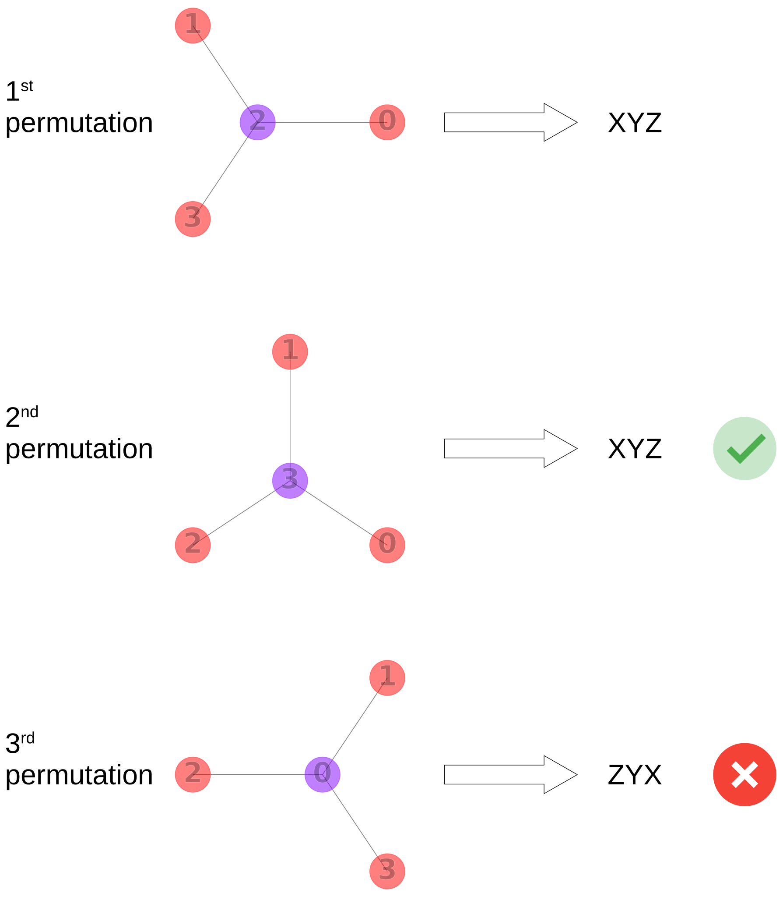
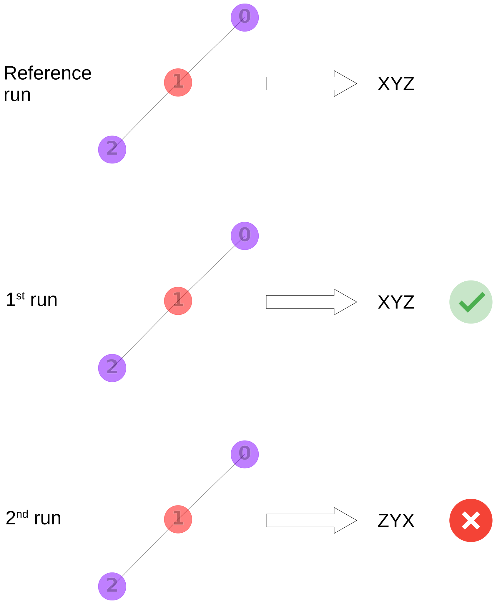

# Testing the InChI

## Test environment

### Docker container

Use our [Dockerfile](Dockerfile) to run the test suite.
Build a Docker image by running the following command from the root of the repository:

```Shell
docker compose -f INCHI-1-TEST/docker-compose.yml build --no-cache
```

The resulting image contains the machinery for running the tests.
Drop into a bash console inside the Docker container by running

```Shell
docker compose -f INCHI-1-TEST/docker-compose.yml run --rm inchi-test bash
```

You can now run the commands that are mentioned in the remainder of this README.

### Visual Studio Code devcontainer

As an alternative to the plain Docker container, you can run the tests in the [Visual Studio Code devcontainer](https://code.visualstudio.com/docs/devcontainers/containers) that's specified under [.devcontainer.json](../.devcontainer/devcontainer.json).
Note that, in contrast to the plain container, in the devcontainer, you'll have to [compile the InChI libraries yourself](../README.md#building-from-source).

## Test data

We follow two conventions for supplying molfiles as test data.

- Inline Python string in a testfile:

  - Benefit of having entire test scenario on screen.
  - Only use with small(ish) molfiles, the benefit of overview is lost quickly with molfiles that require vertical scrolling.

- Compressed [SDF files](https://en.wikipedia.org/wiki/Chemical_table_file#SDF) (i.e., `testdata.sdf.gz`):

  - Use when a test scenario requires many and/or large molfiles.
  - One or multiple SDF files live in a `data` directory inside the test directories (e.g. `tests/test_executable/data`)
  - If an SDF is only used in one place, name the SDF after testfile.

Where possible, stick to the following principles:

- Keep number of tests per file to a minimum.
- When replicating a bug, reference the (GitHub) issue number in the file name (e.g., `test_github_42.py`).

Have a look at the existing tests for examples on how to write a test.

## Unit tests

Our unit test are implemented with [googletest](https://google.github.io/googletest/) and live under `tests/test_unit`.
Build the tests with

```shell
./INCHI-1-TEST/build_with_cmake.sh all
```

and subsequently run them with

```shell
cd CMake_build/full_build/INCHI-1-TEST/tests/test_unit && ctest --output-on-failure
```

## Meta tests

The tests under `tests/test_meta` are testing the tests (e.g., does structure permutation work properly?)
Run with `pytest INCHI-1-TEST/tests/test_meta`.

## Executable tests

The tests under `tests/test_executable` test specific behaviors of the executable.
They ensure that specific input (e.g., molfile and arguments) elicits specific output (e.g., error).

Run with `pytest INCHI-1-TEST/tests/test_executable`.
Note that by default, the tests expect the InChI executable at the location specified in `INCHI-1-TEST/tests/test_executable/conftest.py`.
You can specify another InChI executable as argument to the `--exe-path` parameter:

```shell
pytest INCHI-1-TEST/tests/test_executable --exe-path=path/to/executable
```

## Library tests

Under `tests/test_library` we run tests against the InChI API.

### Datasets

In the following, `<dataset>` refers to either `ci`
(i.e, continuous integration, aka the tests running on GitHub), or a `<subset>` of PubChem.
`<subset>` can be either `compound`, `compound3d`, or `substance`.
The `ci` data already lives in the repository (i.e., `mcule.sdf.gz` and `inchi.sdf.gz` under `INCHI-1-TEST/tests/test_library/data/ci`).
The PubChem `<subset>` data doesn't live in the repository since it's too large.
You can download the `<subset>` data from <https://ftp.ncbi.nlm.nih.gov/pubchem/> by running

```Shell
python -m INCHI-1-TEST.tests.test_library.data.pubchem.download <subset>
```

On completion of the download you'll find the data in `INCHI-1-TEST/tests/test_library/data/pubchem/<subset>`.
Validate the integrity of `<subset>` (i.e., make sure the downloads aren't corrupted) with the hashes provided by PubChem by running

```Shell
python -m INCHI-1-TEST.tests.test_library.data.pubchem.validate <subset>
```

Note that validation isn't available for `compound3d` (PubChem doesn't provide file hashes).

### Multithreading tests

Test the thread safety of the InChI library by running

`python INCHI-1-TEST/tests/test_library/test_multithreading.py`

The script triggers a segfault in case the thread safety of the library is compromised.

### Invariance tests

Invariance tests are meant to detect problems with InChI's canonicalization algorithm.
During an invariance test, the atom indices of a structure are permuted repeatedly and each permutation is expected to result in the same InChI output.



```Shell
python INCHI-1-TEST/tests/test_library/inchi_tests/run_tests.py --test=invariance --lib-path=<path/to/inchi/library> --data-config=INCHI-1-TEST/tests/test_library/config/config_<dataset>.py
```

uses `<path/to/inchi/library>` to compute the InChI output for multiple permutations of each molfile in each SDF under `<dataset>`.
If not all permutations produce the same InChI output,
a test failure is logged under `<datetime>.invariance_<dataset>.log`
(where `<datetime>` reflects the start of the test run).

### Regression tests

Regression tests investigate if the output of the current development version matches the reference output of a previous release.
In other word, regression test are meant to detect problems with the stability of the InChI across versions.
In the image below, the 1st and 2nd run represent tests runs that are conducted after some alternations to the codebase.
On the first run, the output matches the reference.
The 2nd run results in a regression, since the output no longer matches the reference.



#### Compute references

```Shell
python INCHI-1-TEST/tests/test_library/inchi_tests/run_tests.py --test=regression_reference --lib-path=<path/to/inchi/library> --data-config=INCHI-1-TEST/tests/test_library/config/config_<dataset>.py
```

uses `<path/to/inchi/library>` to generate an `<SDF>.regression_reference.sqlite` file for each SDF under `INCHI-1-TEST/tests/test_library/data/<dataset>`.
The `sqlite` file contains a table with the results for each molfile.

#### Run tests against the references

```Shell
python INCHI-1-TEST/tests/test_library/inchi_tests/run_tests.py --test=regression --lib-path=<path/to/inchi/library> --data-config=INCHI-1-TEST/tests/test_library/config/config_<dataset>.py
```

uses `<path/to/inchi/library>` to compute the results (e.g., InChI strings and keys) for each molfile in each SDF under `INCHI-1-TEST/tests/test_library/data/<dataset>`.
Those results are compared with the corresponding reference.
Failed comparisons are logged to `<datetime>.regression_<dataset>.log` (where `<datetime>` reflects the start of the test run).

To convince yourself that the tests fail once a regression has been introduced,
change `INCHI_NAME` in `INCHI-1-SRC/INCHI_BASE/src/mode.h` and re-run the tests.
The tests should now fail and indicate that the difference between the reference results and the latest test run is the change you've made.

### Cross-version campaigns

A campaign compares a released baseline against the working tree over a whole
PubChem dataset, including under a non-default option. It runs three passes over
the same SDFs and re-checks every difference:

| pass | library | options | compared | purpose |
| --- | --- | --- | --- | --- |
| A | baseline tag | none | — | the reference |
| B | working tree | e.g. `-MolecularInorganics` | InChI body only | what the option changes |
| C | working tree | none | byte-for-byte | the control: must reproduce A exactly |

Run the whole thing with one command:

```Shell
./INCHI-1-TEST/run_campaign.sh <compound|compound3d|substance>
```

It creates the virtual environment, builds both libraries in Release mode
(`build_with_cmake.sh` sets no `CMAKE_BUILD_TYPE`, and `libinchi` gates `-O1` on
Release, so an unconfigured build is several times slower), adds a git worktree
for the baseline tag, mirrors and md5-verifies the dataset, runs all three
passes, classifies the differences and writes an HTML report to
`INCHI-1-TEST/tests/test_library/data/pubchem/campaign/<dataset>/report.html`.

Re-running is safe: the environment, the worktree and the per-shard references
are reused, so an interrupted reference pass resumes at the shards it is missing.
Pass `--skip-download` to re-run against data already on disk. `BASELINE_TAG`
(default `v1.07.5`) and `RUN_TAG` are environment overrides.

The script fails loudly on the conditions that otherwise pass silently: a shard
whose md5 does not match (`validate.py` only prints these and always exits 0), a
shard that aborted mid-run (`run_tests.py` logs `Aborted …` and continues, so it
never reaches the exit code), and a leftover `.partial` reference. A non-zero Run
C is reported prominently, because it means Run B's differences cannot be
attributed to the option under test.

#### When a structure never comes back

Canonicalization can take unbounded time on a structure whose atoms are nearly
all equivalent. PubChem SID 141382403 -- 238 atoms, 204 of them phosphorus, 237
bonds -- ran for over ten minutes under v1.07.5 without finishing, and is not
known to terminate at all.

That used to cost the whole shard. `core.run` waited 60s for *any* result, got
none because the other consumers had finished, and reported `A process
terminated unexpectedly` -- a guess, and a wrong one: the consumer was alive and
still computing. All 500000 records of that shard were lost and the campaign
stopped on it.

A consumer that spends longer than `--timeout-seconds-per-molfile` (default 60)
on one record is now killed, and the record is yielded as a timeout instead:

- `regression-reference` writes a row recording the timeout, so the reference
  stays complete. A reference that silently omits a molfile makes every later
  run fail on "Reference contains molfile IDs that haven't been processed",
  which names the shard but not the reason.
- `regression` and `invariance` log `timed out:{...}` with the molfile ID and
  the seconds, and fail the run unless the ID is in the dataset's
  `expected_failures`.

Note that the old behaviour was also *load-dependent*: the 60s was silence on
the result queue, not a per-record budget, so a slow record only aborted the
shard once its neighbours had finished and stopped producing results. The cap is
now on the record itself, which is deterministic.

`bisect_crash.py` walks a shard in a single process and fsyncs the current
molfile ID before each call, so it names the offending structure whether it
crashes or hangs:

```Shell
python INCHI-1-TEST/tests/test_library/inchi_tests/bisect_crash.py \
    --sdf-path=.../Substance_141000001_141500000.sdf.gz \
    --lib-path=.../libinchi.so
```

#### Running the campaign in a container

The campaign runs for days, so it is usually better off in a container than in a
login session. The `inchi-campaign` service exists for that, and is set up
differently from `inchi-test` above:

```Shell
docker compose -f INCHI-1-TEST/docker-compose.yml build
docker compose -f INCHI-1-TEST/docker-compose.yml run --rm \
    inchi-campaign substance --skip-download
```

Arguments after the service name are passed to `run_campaign.sh`, and
`BASELINE_TAG` selects the baseline:

```Shell
BASELINE_TAG=v1.06 docker compose -f INCHI-1-TEST/docker-compose.yml run --rm \
    inchi-campaign compound
```

Unlike `inchi-test`, this service **bind-mounts the repository** instead of using
the copy baked into the image, so it always runs the current working tree and
needs no rebuild after a code change. What the campaign builds goes on named
volumes rather than into that bind mount:

| volume | mounted at | why |
| --- | --- | --- |
| `campaign_build` | `/inchi/CMake_build` | container-built binaries must not overwrite the host's |
| `campaign_worktree` | `/campaign/worktree` | `run_campaign.sh` puts the baseline worktree beside the repo, which is outside the mount and would be lost on exit |
| `campaign_venv` | `/opt/campaign/venv` | a virtualenv's interpreter paths are only valid inside the container |

All three persist between runs, so a re-run reuses the builds rather than
repeating them. `WORKTREE` and `VENV` are what redirect the script onto them;
both default to the in-repo paths when unset, so a host run is unaffected.

The container runs as `1001:1001` so that references, logs and the report stay
owned by the host user instead of root. If your UID differs, set `CAMPAIGN_UID`
and `CAMPAIGN_GID` at **both** build and run time — they are a build argument as
well, because the volume mount points must be created with that ownership:

```Shell
CAMPAIGN_UID=$(id -u) CAMPAIGN_GID=$(id -g) \
    docker compose -f INCHI-1-TEST/docker-compose.yml build
```

Two things this buys beyond convenience: the `python:3.12` image has `ensurepip`,
so `run_campaign.sh` can create its virtualenv on hosts whose system Python
cannot; and `git worktree` bookkeeping is written into the bind-mounted `.git`,
where a registration can outlive the volume holding the worktree — which is why
the script prunes stale registrations before adding one.

#### How the comparison works

Comparing raw InChI strings across option sets does not work. `-MolecularInorganics`
sets `is_beta` from the option alone, so *every* structure changes prefix
(`InChI=1S/` to `InChI=1B/`) and InChIKey flag — metal-free organics included — and
a byte comparison would mark an entire dataset as changed.

Campaign runs therefore store the raw result (full InChI, key, exit code) and
decide at comparison time what counts as a match. A run that passes
`--compare=prefix-insensitive` compares the InChI *body* plus a failure flag,
where failure means `exit >= 2` or an empty InChI. Exit code 1 is a warning, and a
metal disconnection always warns, so treating it as failure would misclassify most
of the structures of interest. The differences the comparison ignores are counted
and logged as `prefix_only`, `key_only`, `warning_only`, `both_failed` and
`failure_kind_only` — the last being two runs that both failed on the same body
with different error codes, which is a failure kind rather than a warning flip.

Leniency is opted into per run and is **not** implied by `--run-tag`. Run C is
tagged — it reads Run A's tagged reference — but it is the control, so it keeps
the default `--compare=exact`. A prefix-insensitive Run C could not see a changed
prefix, InChIKey or warning level, which is exactly the version drift it exists to
catch, and it would still print that the working tree reproduces the baseline.

`--inchi-api-parameters` requires `--run-tag`, because options change the output
but not the reference filename: an untagged reference run would otherwise
overwrite the canonical `<shard>.regression_reference.sqlite` that ordinary
regression runs read.

Differences are then classified against the baseline's `-RecMet` output. The old
code breaks bonds to metals by two routes and `-RecMet` only reverses one of
them, so:

- `recmet_equivalent` — the option's InChI equals the `-RecMet` reconnected
  (`/r`) layer: the old code disconnected the metal and `-RecMet` put it back.
- `novel` with an `/r` layer — both reconnect, and disagree.
- `novel` without one — the old code used salt disconnection, which `-RecMet`
  cannot undo.
- `error_under_mi` / `error_in_reference` / `recmet_failed` / `recmet_missing` —
  one side produced no InChI.

`classifications.csv` carries one row per mismatch with the InChI, InChIKey and
exit code of all three sides -- baseline, the option under test, and the `-RecMet`
re-check -- so it can be queried without going back to the logs. An empty
`recmet_*` cell means no re-computation was made for that structure.

#### Mismatch IDs per cause

Every run also writes the molfile ID of each mismatch to one file per cause, so a
set of structures can be fed straight into another tool:

```
INCHI-1-TEST/tests/test_library/data/pubchem/campaign/<dataset>/ids/
    recmet_equivalent.txt     novel_metal_pathway.txt   novel_salt_pathway.txt
    error_under_mi.txt        error_in_reference.txt
    recmet_failed.txt         recmet_missing.txt
```

One ID per line, numerically sorted where the IDs are numeric. `novel` is split by
disconnection pathway, which is the distinction that matters when following one up.
Every file is written even when empty, so a consumer can rely on the filenames.

To rebuild only the report from an existing run:

```Shell
python INCHI-1-TEST/tests/test_library/inchi_tests/report.py \
    --classifications .../data/pubchem/campaign/<dataset>/classifications.csv \
    --summary .../data/pubchem/campaign/<dataset>/summary.json \
    --output INCHI-1-TEST/tests/test_library/data/pubchem/campaign/<dataset>/report.html
```

Anything the report cannot establish from its inputs renders as *not checked* or an
em dash rather than as a passing number: without `--run-c-log` the control is not
measured, without `--run-a/b/c-log` the aborted-shard gate has nothing to read, and
without `--expected-structures` the completeness gate has no independent count to
check the comparison against. `run_campaign.sh` passes all four, so a full run
fills them in; the logs it copies into `logs/` are what a later rebuild should
point at.

### Inspect test results

In addition to inspecting the raw logs, you can review the results by running

```Shell
python INCHI-1-TEST/tests/test_library/inchi_tests/parse_log.py --test=<test> --lib-path=<path/to/inchi/library> --data-config=INCHI-1-TEST/tests/test_library/config/config_<dataset>.py
```

where `<test>` can be `regression` or `invariance`.
The command generates an HTML report for each SDF under `INCHI-1-TEST/tests/test_library/data/<dataset>` that contains structures which failed the test.
You can view the HTML report in your browser.

### Inspect `.sqlite` files

For conveniently viewing `.sqlite` files, install the `SQLite Viewer` extension for VSCode: <https://marketplace.visualstudio.com/items?itemName=qwtel.sqlite-viewer>. Otherwise you can query the `.sqlite` files with the [sqlite command line utility](https://sqlite.org/cli.html).

### Test customization

So far, we showed how to run the tests with our configuration against our datasets.
Alternatively, you can run the tests against your own data and/or adapt the configuration.

Before showing examples of how to customize the tests, let's look at how we're configuring them.
Our [docker-compose.yml](docker-compose.yml) shows how to inject the data and configuration into the [container](#docker-container)
via [volumes](https://docs.docker.com/compose/compose-file/05-services/#volumes):

```yml
volumes:
  - type: bind
    source: tests/test_library/data
    target: /inchi/INCHI-1-TEST/tests/test_library/data
  - type: bind
    source: tests/test_library/config
    target: /inchi/INCHI-1-TEST/tests/test_library/config
```

Note that the `source` paths are relative to the location of the `docker-compose.yml` file.
We're mapping the `tests/test_library/data` directory on the host machine to the `/inchi/INCHI-1-TEST/data` directory inside the container.
Similarly we're mapping `tests/test_library/config`, a directory containing our [configuration files](#configuration-files), into `/inchi/INCHI-1-TEST/config`.

To customize the tests, start by adding your own `docker-compose.custom.yml` file:

```yml
services:
  inchi-custom-test:
    build:
      context: ..
      dockerfile: INCHI-1-TEST/Dockerfile
```

Make sure to adapt `context` to your directory structure. `context` needs to be the path to the `InChI` repository,
relative from `docker-compose.custom.yml`.

#### Your own dataset

You can map a single SDF file or a directory containing SDF files into the container's `/inchi` directory by specifying a volume:

```yml
services:
  inchi-custom-test:
    build:
      context: ..
      dockerfile: INCHI-1-TEST/Dockerfile
    volumes:
      # `source` paths are relative to the `docker-compose.yml` file, not the build context.
      # `target` paths are absolute paths in the container. The `/inchi` directory already exists in the container.
      - type: bind
        source: host/machine/path/to/custom/data
        target: /inchi/data
```

#### Your own configuration

Next, add a volume to inject your [configuration files](#configuration-files) into the container:

```yml
services:
  inchi-custom-test:
    build:
      context: ..
      dockerfile: INCHI-1-TEST/Dockerfile
    volumes:
      # `source` paths are relative to the `docker-compose.yml` file, not the build context.
      # `target` paths are absolute paths in the container. The `/inchi` directory already exists in the container.
      - type: bind
        source: host/machine/path/to/custom/data
        target: /inchi/data
      - type: bind
        source: host/machine/path/to/custom/config
        target: /inchi/config
```

#### Configuration files

The tests can be configured with Python files (e.g., `config.py`).
The configuration files must have [valid Python module names](https://docs.python.org/dev/reference/lexical_analysis.html#identifiers).
We're not using other configuration formats (e.g., `config.yaml`),
since the configuration needs to be powerful enough to enable dynamic customization (e.g., parsing molfile ID).
We provide a[template](tests/test_library/inchi_tests/config_models.py) under `config_models.py` that allow you to customize the configuration:

##### `DataConfig`

Lets you configure your custom data, e.g., location of the data.
For details, have a look at the comments in the `DataConfig` class.
Your configuration file, e.g., `config/custom-data.py` must contain an instance of `DataConfig` called `config`.
For an example of how to instantiate a `DataConfig` object, have a look at our [CI configuration](tests/test_library/config/config_ci.py).
Note that the `DataConfig` object must point to data that you've [mounted into the container](#your-own-dataset).
For an example of how to instantiate a `DataConfig` object, have a look at our the configuration of our [CI data](tests/test_library/config/config_ci.py).

#### Run your custom tests

Once you've written the `docker-compose.custom.yml` and your [configuration files](#configuration-files), build a custom image with

```Shell
docker compose -f path/to/docker-compose.custom.yml build --no-cache
```

You can now start the container and drop into a bash shell

```Shell
docker compose -f path/to/docker-compose.custom.yml run --rm inchi-custom-test bash
```

and run the test according to your configuration against your data

```Shell
python INCHI-1-TEST/tests/test_library/inchi_tests/run_tests.py --test=<test> --lib-path=<path/to/inchi/library> --data-config=config/custom-data.py
```

with `<test>` being one of "regression", "regression-reference", or "invariance".
