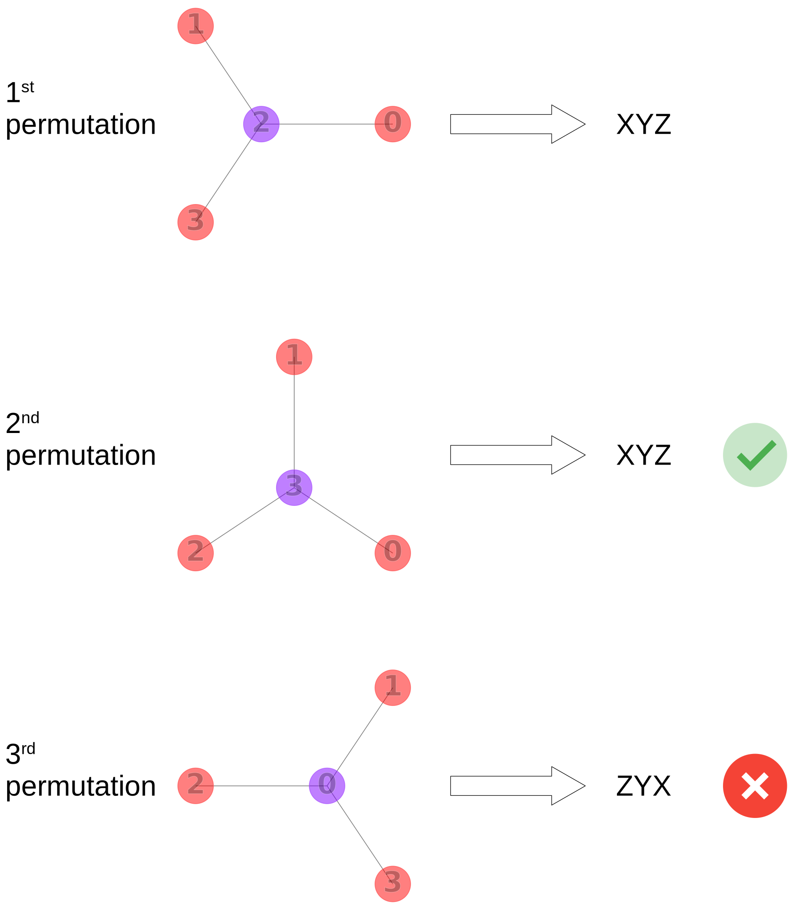
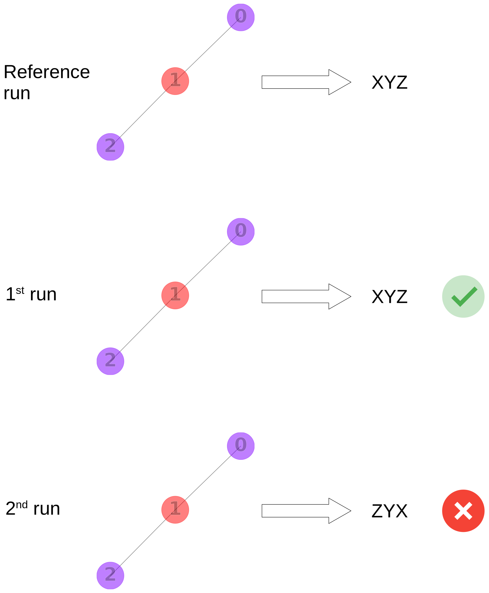

# Testing the InChI

## Datasets

In this README, `<dataset>` refers to either `ci`
(i.e, continuous integration, aka the tests running on GitHub), or `pubchem-<subset>` (`<subset>` can be either `compound`, `compound3d`, or `substance`).
The `ci` data already lives in the repository (i.e., `mcule.sdf.gz` and `inchi.sdf.gz` under `INCHI-1-TEST/data/ci`).
The `pubchem-<subset>` data doesn't live in the repository since it's too large.
You can download the `pubchem-<subset>` data from <https://ftp.ncbi.nlm.nih.gov/pubchem/> by running

```Shell
python -m INCHI-1-TEST.data.pubchem.download pubchem-<subset>
```

On completion of the download you'll find the data in `INCHI-1-TEST/data/pubchem/<subset>`.
Validate the integrity of `pubchem-<subset>` (i.e., make sure the downloads aren't corrupted) by running

```Shell
python -m INCHI-1-TEST.data.pubchem.validate pubchem-<subset>
```

Note that validation isn't available for `pubchem-compound3d` (PubChem doesn't provide file hashes).

### Your own dataset

You can run the tests against your own dataset(s).
To add a `foo` dataset, extend the `DATASETS` configuration in [config.py](../config.py):

```Python
def get_molfile_id(molfile: str) -> str:
    return molfile.split()[0].strip()

DATASETS: Final[dict[str, dict[str, Any]]] = {
    "foo": {
        "sdf_paths": [Path("/my/data/directory/foo.sdf.gz")],
        "log_path": Path("/my/log/directory"),
        "molfile_id": get_molfile_id,
    },
}
```

A `DATASETS` entry requires three key-value pairs:

1. `sdf_paths`: A list of one or more [Path objects](https://docs.python.org/3/library/pathlib.html#pathlib.Path) that contain the *absolute* path(s) to [gzipped](https://en.wikipedia.org/wiki/Gzip) [SDF files](https://en.wikipedia.org/wiki/Chemical_table_file#SDF). If your dataset contains multiple `SDF` files, you can collect them into a list with a bit of Python: `list(Path("/my/data/directory").glob("*.sdf.gz"))`. The tests automatically run against all `SDF` files that you list here.
2. `log_path`: A `Path` object that contains the *absolute* path where you'd like to collect the test logs.
3. `molfile_id`: A Python [function](https://docs.python.org/3/reference/datamodel.html#callable-types) that parses the molfile ID from a single SDF record. It must take one argument only, which is a [string](https://docs.python.org/3/library/stdtypes.html#text-sequence-type-str) containing the molfile and return a string containing the molfile ID. See `get_molfile_id()` above for an example.

Once you've added the `foo` entry, you can select `foo` as `<dataset>` in all commands in this README.

## Test environment

Use our [Dockerfile](../Dockerfile) to run the test suite.
Start by building a Docker image with

```Shell
docker build -t inchi-tests ./INCHI-1-TEST
```

Subsequently you can drop into a terminal inside of the Docker container by running

```Shell
docker run --rm -it -v $(pwd):/inchi inchi-tests bash
```

On Windows, wrap the argument to `-v` in quotation marks: `"$(pwd):/inchi"`.

From the `inchi` directory in the Docker container you can run the commands that are mentioned in the remainder of this README.

Alternatively, you can run single commands non-interactively:

```Shell
docker run --rm -v $(pwd):/inchi inchi-tests bash -c "cd inchi && <command>"
```

If you prefer, run the tests in the [Visual Studio Code devcontainer](https://code.visualstudio.com/docs/devcontainers/containers)
that's specified under [.devcontainer.json](../../.devcontainer.json).
The `devcontainer` is built on the `Dockerfile` that's mentioned above.

## Invariance tests

Invariance tests are meant to detect problems with InChI's canonicalization algorithm.
During an invariance test, the atom indices of a structure are permuted repeatedly and each permutation is expected to result in the same InChI output.



```Shell
python -m INCHI-1-TEST.run_tests invariance <dataset>
```

compiles the shared library `libinchi.so.dev` from the current state of the repository.
It then uses this library to compute the InChI output for multiple permutations of each molfile in each SDF under `<dataset>`.
If not all permutations produce the same InChI output,
a test failure is logged under `<datetime>.invariance_<dataset>.log`
(where `<datetime>` reflects the start of the test run).

## Regression tests

Regression tests investigate if the output of the current development version matches the reference output of a previous release.
In other word, regression test are meant to detect problems with the stability of the InChI across versions.
In the image below, the 1st and 2nd run represent tests runs
that are conducted after some alternations to the codebase.
On the first run, the output matches the reference.
The 2nd run results in a regression, since the output no longer matches the reference.



### Compute references

```Shell
python -m INCHI-1-TEST.run_tests regression-reference <dataset>
```

compiles `libinchi.so.v1.06`, the shared library belonging to the current stable InChI release,
and generates an `<SDF>.regression_reference.sqlite` file for each SDF under `INCHI-1-TEST/data/<dataset>`.
The `sqlite` file contains a table with the results for each molfile.

### Run tests against the references

```Shell
python -m INCHI-1-TEST.run_tests regression <dataset>
```

compiles the shared library `libinchi.so.dev` from the current state of the repository.
It then uses this library to compute the results (e.g., InChI strings and keys) for each molfile in each SDF under `INCHI-1-TEST/data/<dataset>`.
Those results are compared with the corresponding reference.
Failed comparisons are logged to `<datetime>.regression_<dataset>.log` (where `<datetime>` reflects the start of the test run).

To convince yourself that the tests fail once a regression has been introduced,
change `INCHI_NAME` in `INCHI-1-SRC/INCHI_BASE/src/mode.h` and re-run the tests.
The tests should now fail and indicate that the difference between the reference results and the latest test run is the change you've made.

## Inspect test results

You can review the results by running

```Shell
python -m INCHI-1-TEST.parse_regression_log <dataset>
```

or

```Shell
python -m INCHI-1-TEST.parse_invariance_log <dataset>
```

The command generates an HTML report for each SDF under `INCHI-1-TEST/data/<dataset>` that contains structures which failed the regression test.
You can view the HTML report in your browser.

## Inspect `.sqlite` files

For conveniently viewing `.sqlite` files, install the `SQLite Viewer` extension for VSCode: <https://marketplace.visualstudio.com/items?itemName=qwtel.sqlite-viewer>. Otherwise you can query the `.sqlite` files with the [sqlite command line utility](https://sqlite.org/cli.html).
